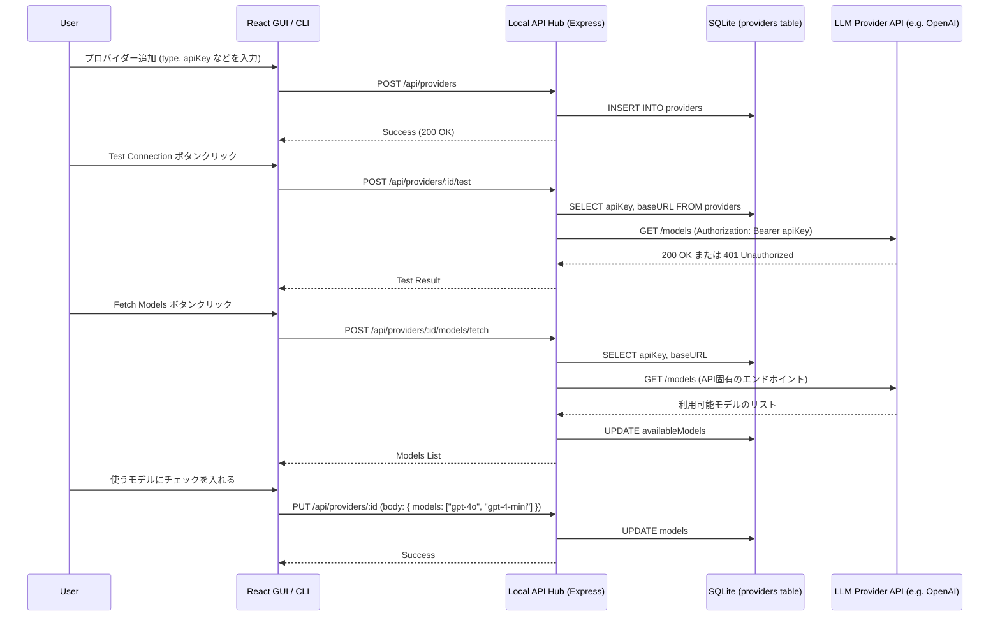

# AI Provider Management (Workflow & Data Storage)

このドキュメントでは、Alma（Protan）におけるAIプロバイダー（OpenAI, Anthropic 等）の登録から編集、モデル取得（Fetch）、削除までの **管理ワークフロー** と **データ保存形式（Schema）** について解説します。

## 1. データ保存形式 (Storage & Schema)

AIプロバイダーの情報は、JSONファイルではなく、ローカルの **SQLite データベース (`providers` テーブル)** に厳密なスキーマを持って保存されています。

### 🗄️ `providers` テーブルのスキーマ定義
リバースエンジニアリングで判明した ORM（恐らく Drizzle ORM など）のスキーマ定義は以下の通りです：

| Column | Type | Description |
| :--- | :--- | :--- |
| `id` | `TEXT` (PK) | プロバイダーの一意なID (UUID等) |
| `name` | `TEXT` | 表示名 (例: "My OpenAI") |
| `type` | `ENUM` | プロバイダーの種類。`openai`, `anthropic`, `google`, `openrouter`, `deepseek`, `ollama` などがハードコードで許可されている |
| `apiKey` | `TEXT` | 認証用 APIキー (平文で保存されているためUIへの露出は厳禁) |
| `baseURL` | `TEXT` | カスタムエンドポイントのURL (オプション) |
| `apiVersion` | `TEXT` | Azure OpenAI などのためのバージョン指定 |
| `models` | `JSON` | **ユーザーが手動で有効化** したモデルIDの配列（例: `["gpt-4o", "o1"]`） |
| `availableModels` | `JSON` | APIから自動フェッチ（`fetchProviderModels`）した**利用可能なすべてのモデル**の詳細情報（ID, 名前, capabilities等）の配列 |

---

## 2. プロバイダー管理の WorkFlow と API マッピング

ユーザーが設定画面（UI）や CLI (`alma provider add`) からプロバイダーを管理する際の、バックエンド API の処理フローです。

### 🔄 データフロー図 (Provider Management Flow)

## 3. 各 API エンドポイントの実装詳細

ソースコード（`out/main/index.js`）から抽出した各エンドポイントの振る舞いです。

### 📥 登録・編集 (`POST /api/providers`, `PUT /api/providers/:id`)
- ユーザーから送信された `type`（例: openai）、`apiKey` などをそのまま SQLite の `providers` テーブルに INSERT/UPDATE します。
- UI に返すレスポンスでは、セキュリティのため `apiKey` の値を意図的にマスク（例: `sk-...xxxx`）するか、フロントエンドに送らない設計にすることが推奨されます。

### 📡 疎通確認 (`POST /api/providers/:id/test`)
- 登録されたAPIキーが正しいかを確認するためのエンドポイントです。
- 内部的には、次項の「モデルの Fetch」と同じようにプロバイダーごとの `/models` エンドポイント（あるいは非常に安価な Ping 用 API）を叩き、HTTP `200 OK` が返ってくるかを確認します。

### 🔄 モデル自動取得 (`POST /api/providers/:id/models/fetch`)
Almaの賢い機能の一つで、ユーザーがいちいちモデル名（`gpt-4o` など）を手打ちしなくても、APIから自動でリストを取得します。
- **実装ロジック**:
  - `type == "openai"` の場合: `https://api.openai.com/v1/models` に対して GET リクエストを送信し、レスポンスの `data.id` を抽出します。
  - `type == "anthropic"` の場合: Anthropic の Models API に合わせた専用のエンドポイントを叩きます。
- 取得した結果は DB の `availableModels` JSON カラムに保存され、設定画面のドロップダウンリストの選択肢として表示されます。

### 🗑️ 削除 (`DELETE /api/providers/:id`)
- 単純に SQLite から該当 ID のレコードを `DELETE` します。

## 4. Protan開発への応用 (Key Takeaways)

プロタンのバックエンド（エンジン）を開発する際、プロバイダー管理は以下のように実装するべきです。

1. **Storage は SQLite**:
   設定ファイル（`config.json`）に入れても動きますが、将来的に「チーム共有のプロバイダー」や「利用統計（Usage）」とリレーションを組むことを考えると、Almaのように最初から SQLite テーブルとして定義するのがベストです。
2. **モデルリストの分離**:
   「APIが提供している全モデルのリスト（`availableModels`）」と「ユーザーが実際にチャットで使いたいモデルのリスト（`models`）」をDBの別のカラムで分ける設計は、UIの使い勝手を劇的に向上させます。
