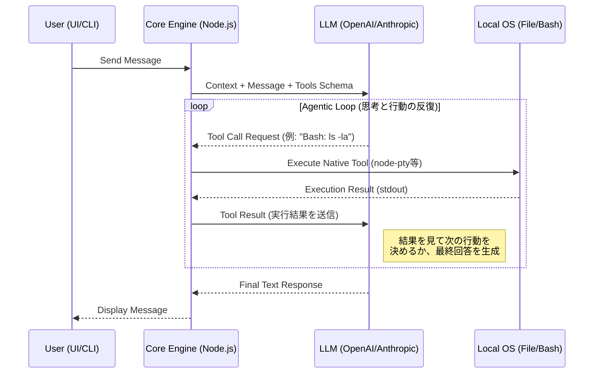

# Alma (Protan) Core Engine Architecture

このドキュメントでは、「プロタン」開発の第一歩となる最も重要なバックエンドの中核（Core Engine）の設計と実装について解説します。
Almaが単なるチャットボットではなく、「自律的に思考し、行動するエージェント」として機能するための心臓部です。

## 1. サーバーアーキテクチャ (The Local API Hub)

Almaのエジンは、メインプロセス（Node.js）上で常駐する **Express.js APIサーバー (`http://localhost:23001`)** として実装されています。

- **役割**: フロントエンド（React UI）やCLI（ターミナル）からのすべての要求を中央で受け付けるハブ。
- **なぜローカルAPIなのか？**:
  フロントエンドから直接外部のLLM（OpenAI等）を叩くと、OSレベルのコマンド実行（`Bash`ツール）や、ローカルファイル（`Read/Write`）の操作ができません。
  UIからのチャットリクエストを一旦このローカルサーバーで受け止め、サーバー側でLLMと通信し、LLMから「ツールを使いたい」と返ってきたらサーバー側でOS権限を使ってツールを実行する（エージェントループ）ために必須の設計です。

---

## 2. プロンプト合成エンジン (Context Synthesis)

ユーザーからメッセージが届いた際、LLMに送る直前に実行される「コンテキストの動的合成」プロセスです。

1. **System Prompt (Base)**:
   ハードコードされた基本ルール（「あなたは人間だ」「APIキーは隠せ」など）をベースにする。
2. **Identity Injection**:
   `~/.config/alma/SOUL.md` (性格・外見) と `USER.md` (相手の情報) の物理ファイルを読み込み、プロンプトの最上部に結合する。
3. **Memory Retrieval (RAG)**:
   ユーザーの入力ベクトルを `sqlite-vec` で検索し、過去の関連する会話スニペットを抽出してプロンプトの背景情報（Background Context）として追加する。
4. **Tool Definitions**:
   現在利用可能な Native Tools（Bash, Read等）のJSON Schema定義と、動的にロードされた Skills（`SKILL.md`）のマニュアルを結合する。

**【ポイント】**: LLMに渡されるプロンプトは、ユーザーの入力テキストだけではなく、この「合成エンジン」によって毎回数千〜数万トークンの巨大なコンテキストとして組み上げられます。

---

## 3. エージェント・ループ (The Agentic Loop)

LLM（ClaudeやGPT-4oなど）からの応答を処理する、エージェントエンジンの「思考と行動のループ」です。

### ツールのインターセプトと実行
エンジン内には、LLMから要求されたツール名を解析し、OS機能にマッピングするルーターが存在します。
- `Bash`: リクエスト内のコマンド文字列を取り出し、`node-pty`（仮想ターミナル）のセッションに流し込み、出力（stdout）を待機して回収する。
- `Task`: 別の非同期エージェントループ（サブエージェント）を新規スレッドとしてスピンオフさせる。
- `BrowserOpen`: Playwrightのインスタンスを立ち上げてブラウザを操作する。

## 4. Protan開発の最初のステップ (Day 1)

「プロタン」のエンジン開発に着手する際、以下の順序でバックエンドを構築していくのが最適です。

1. **Expressサーバーの立ち上げ**: ポート `23001` でリクエストを受け付ける骨組みを作る。（UIは後回しで、Postmanやcurlでテストできるようにする）
2. **LLM Proxy層の実装**: 受け取ったメッセージを単純に OpenAI/Anthropic のAPIに転送し、テキストを返すラッパーを作る。
3. **Tool Execution（手足）の実装**: LLMに `Bash` と `Read/Write` ツールのSchemaを渡し、LLMからTool Callが返ってきたら Node.js の `child_process` (または `node-pty`) でローカル実行して結果を返す「ループ」を実装する。
4. **Context Builderの追加**: リクエスト送信前に `SOUL.md` などのテキストファイルを読み込んで結合するロジックを挟み込む。

この4ステップが完成した時点で、UIがなくても「ターミナルから指示すると、勝手にファイルを探してコードを書き換えてくれる自律エージェントの心臓」が完成します。
