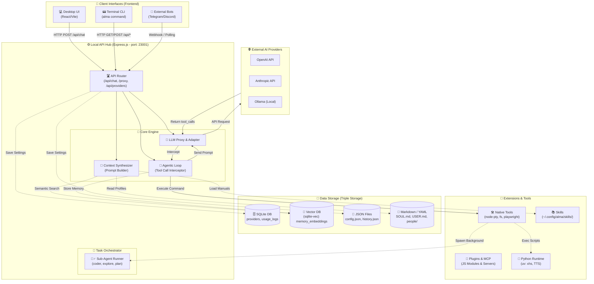

# Protan (Alma) System Overview & Architecture Diagram

このドキュメントでは、「プロタン」のシステム全体像（フロントエンド、バックエンド、データベース、外部システム、AIプロバイダー）を俯瞰するためのアーキテクチャ図と、それぞれのモジュール間のデータフローを可視化します。
開発ロードマップとスケジュールを策定するための「設計の地図」として機能します。

## 1. システム全体俯瞰図 (System Architecture Diagram)

以下の Mermaid 図は、プロタンを構成するすべてのコンポーネント、モジュール、データフローを一枚にまとめたものです。

## 2. モジュール別の機能と開発フェーズのマッピング

上記の図を元に、どのモジュールがどの機能（要件）を担当しているか、そしてロードマップ上どのタイミングで開発すべきかを整理します。

### ⚙️ フェーズ1: 基礎インフラとプロキシ (Local API Hub)
- **モジュール**: `ExpressServer (Router, Proxy)`, `Storage (SQLite)`
- **機能**: 
  - APIキーをDBに隠蔽し、UIから OpenAI / Anthropic などの外部API（`External`）へ通信を中継（ストリーミング）する。
  - プロバイダーとモデルの登録・管理 (`/api/providers`)。
- **マイルストーン**: UIがなくとも、Postmanから `http://localhost:23001/proxy/...` を叩いてAIとチャットできる状態。

### 🧠 フェーズ2: エージェントの心臓部 (Core Engine & Context)
- **モジュール**: `Context Synthesizer`, `Storage (Markdown)`
- **機能**:
  - LLMにリクエストを送る直前に、`SOUL.md` (人格) や `USER.md` (ユーザー情報) をシステムプロンプトとして動的に結合する。
  - 言語の自動追従（Language Matching）や、AIに対する行動の強制ルールを適用する。

### 🛠️ フェーズ3: 手足の獲得 (Agentic Loop & Native Tools)
- **モジュール**: `Agentic Loop`, `NativeTools`
- **機能**:
  - LLMからの応答が `tool_calls` だった場合、クライアント（UI）に返さずにサーバー内でインターセプトするループ (`while` 構文) の実装。
  - `node-pty` を用いたバックグラウンドでのターミナル（Bash）実行と、`fs` を用いたローカルファイルの読み書き。
- **マイルストーン**: ターミナルから指示するだけで、AIが勝手にMac内のファイルを探して書き換えてくれる状態。

### 🌟 フェーズ4: 拡張性と非同期タスク (Extensions & Sub-Agents)
- **モジュール**: `Skills`, `TaskRunner`
- **機能**:
  - ユーザーが作成した Markdown (`SKILL.md`) を読み込み、プロンプトにインジェクションする。
  - メインループとは別に、非同期で別の LLM セッション（`coder`, `Explore` 等）を立ち上げ、長時間かかるタスクをバックグラウンドで処理する仕組み (`Task` / `TaskOutput` ツール)。

### 💾 フェーズ5: 記憶の永続化 (Vector DB)
- **モジュール**: `Storage (VectorDB)`
- **機能**:
  - `sqlite-vec` を用いたローカル環境での 1536次元 ベクトル埋め込みと類似度検索（RAG）。
  - 裏側（非同期）で会話履歴から重要な「個人の事実」を抽出し、DBに自動保存・自動クリーンアップする仕組み（Hidden Prompts）。

### 💻 フェーズ6: フロントエンドとデスクトップ外殻 (Clients)
- **モジュール**: `UI (React/Vite)`, `Electron`
- **機能**:
  - サーバーのAPIを叩いて画面を描画する（チャット、設定モーダル、過去ログ検索）。
  - `WidgetRenderer` を用いた Sandboxed Iframe 内での動的 UI (Generative UI) の生成と、双方向通信 (`send-prompt`)。

---

## 3. スケジュール作成のためのポイント
「プロタン」は完全に **APIファースト（バックエンド主導）** な設計になっています。
そのため、開発スケジュールを組む際は、フロントエンド（React）とバックエンド（Express）を同時に進めるのではなく、**「フェーズ3（Agentic LoopとNative Tools）までバックエンドエンジニアが先行して作り、APIが安定した段階でフロントエンドエンジニアがUIを被せる」** という進め方が最も効率的で手戻りが少なくなります。
