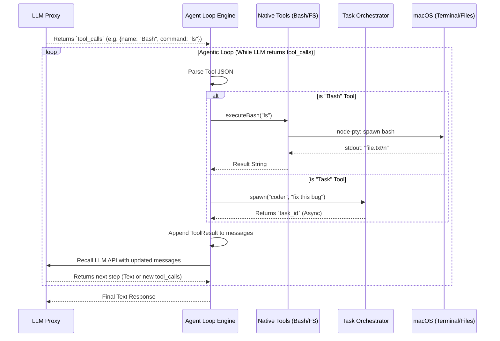

# Module: Agent Loop & Tool Execution Engine

## 1. 機能概要 (Overview)
Agent Loop モジュールは、Alma (Protan) を単なるチャットボットから**「あなたのPCを操作する自律エージェント」**へと昇華させる、システムの「手足」であり「心臓部」です。
LLMから返却された JSON 形式の「ツール呼び出し（Tool Calls）」をインターセプトし、Node.js の OS レベルの権限を用いて実際にコマンドを実行し、その結果を再度 LLM に送信して思考を繰り返させる（Agentic Loop）役割を担います。

- **役割**:
  - LLMからの `tool_calls` の傍受と解析。
  - Native Tools (`Bash`, `Read`, `Write`, `Task` 等) のセキュアな実行。
  - `node-pty` を用いたバックグラウンドでの疑似ターミナル維持とストリーミング。
  - ツール実行結果 (Observation) の構築と、再帰的な LLM API の呼び出し。

## 2. 担当する機能要件 (Functional Requirements)
1. **Tool Interception (傍受)**:
   - LLMからの応答ストリームまたは完了ペイロード内に `tool_calls` が含まれているかを検知し、UIへの返却を保留（またはステータスのみ通知）する。
2. **Native Tool Execution (手足の実行)**:
   - **`Bash`**: `node-pty` または `child_process.spawn` を使用してシェルスクリプトを実行し、`stdout`/`stderr` をキャプチャする。
   - **`Read` / `Write` / `Edit`**: `fs.promises` を用いてローカルファイルの読み書き・置換を行う。
   - **`BrowserOpen` / `ChromeRelay`**: Playwright や Chrome DevTools Protocol を用いてブラウザを操作する。
3. **Sub-Agent Orchestration (`Task` Tool)**:
   - 重い処理の場合、別の非同期バックグラウンドプロセスとして新しい Agent Loop を立ち上げる（`subagent_type: "coder"` 等）。
4. **The Recursive Loop (再帰呼び出し)**:
   - ツールの実行結果を文字列化し、`role: "tool"` (または相当) のメッセージとして会話履歴（Messages 配列）に追記し、**自動的にもう一度 LLM Proxy を呼び出す**。LLMが「タスク完了（テキストのみの返答）」と判断するまでこのループを続ける。

## 3. Workflow (処理フロー)



## 4. DataModel & Tool Schemas

このモジュールが LLM とやり取りするツール定義（JSON Schema）の一部です。

### 🛠️ 1. `Bash` Tool Schema
```json
{
  "name": "Bash",
  "description": "Execute bash commands inside the workspace. Supports foreground execution and background shells retrievable via BashOutput.",
  "parameters": {
    "type": "object",
    "properties": {
      "command": { "type": "string", "description": "The shell command to run" },
      "run_in_background": { "type": "boolean" },
      "timeout": { "type": "integer" }
    },
    "required": ["command"]
  }
}
```

### 🛠️ 2. `Task` Tool Schema (Sub-Agent)
```json
{
  "name": "Task",
  "description": "Launch a new agent to handle complex, multi-step tasks autonomously.",
  "parameters": {
    "type": "object",
    "properties": {
      "subagent_type": { 
        "type": "string", 
        "enum": ["general-purpose", "coder", "Explore", "Plan", "alma-guide", "alma-operator", "statusline-setup"]
      },
      "prompt": { "type": "string" },
      "run_in_background": { "type": "boolean" }
    },
    "required": ["subagent_type", "prompt"]
  }
}
```

## 5. UI Components (関連するフロントエンド)
Agent Loop の実行状況は、UI上でリアルタイムに可視化される必要があります。

- **`Tool Execution Indicator` (Chat Area)**: 
  - AIが `Bash` や `Read` ツールを実行している最中（ループが回っている間）、「🔍 ローカルファイルを検索中...」「💻 ターミナルで実行中...」といったローディング状態（Spinner）を表示するコンポーネント。
- **`Terminal Output Preview`**: 
  - `Bash` ツールの実行結果（`stdout`）が長すぎる場合、UI上で折りたたみ可能（Collapsible）なコードブロックとして、ユーザーが実際のターミナルログを確認できるコンポーネント。
- **`Stop Button` (Chat Input)**: 
  - LLMが無限ループ（例: エラーを直せずに何十回も `Bash` と `Edit` を繰り返す）に陥った際、ユーザーがループを強制終了（`tree-kill` でプロセスを破棄）するための停止ボタン。

## 6. Protan 開発の最大のハードル (Implementation Focus)
「プロタン」のバックエンド開発において、このモジュールが**最も難易度が高く、かつ最も面白い部分**です。

1. **`node-pty` の安定稼働**:
   - `child_process.exec` と違い、`node-pty` は状態（環境変数やカレントディレクトリ）を保持できますが、プロセスがゾンビ化しないようにタイムアウトやエラーハンドリングを完璧に実装する必要があります。
2. **Infinite Loop の防止**:
   - LLMが「コンパイルエラーを吐き続けるコード」を修正しようと無限にリトライするのを防ぐため、ループの最大回数（Max Turns）を設定する安全装置（Circuit Breaker）が必須です。

3. **LLMの JSON パースエラー (Malformed Tool Calls)**:
   - AIが必ずしも正しい JSON を返してくるとは限りません。(`"command": "ls"` ではなく `"command": "ls"}` のようにカッコが閉じられていない等)。
   - `zod` 等のパーサーを用いて例外をキャッチし、**AI自身に「JSONが間違っているから修正して再送信しろ」と自動でエラー結果をフィードバックする** 自己修復ロジック（Self-Correction）が必須です。

4. **Context Window (トークン制限) の爆発**:
   - `Bash` コマンドで `cat package-lock.json` のような巨大なファイルを開いてしまうと、一瞬でコンテキスト制限を超えてチャットが崩壊します。
   - 解決策として、ツールの戻り値（stdout）を傍受し、**「10,000文字を超えたらTruncate（切り捨て）して、"...(truncated)" と末尾に追加する」** などの防波堤（Guardrails）を Agent Loop 層に組み込む必要があります。

5. **状態（State）を持つツールへの対応**:
   - `cd`（ディレクトリ移動）や `export`（環境変数の設定）のようなコマンドは、プロセスが死ぬとリセットされます。
   - だからこそ、Alma (Protan) では毎回 `child_process.exec` を呼ぶのではなく、**ワークスペース（スレッド）ごとに `node-pty` の永続的なインスタンス（シェル）を1つ保持し続ける** という難易度の高いステートフルな設計が採用されています。

## 7. まとめ
この Agent Loop が堅牢に実装されれば、UI（フロントエンド）がどうであれ、CLIからでもBotからでも**「PCを自律的に操作できるAI」**が成立します。プロタンの開発において、すべてのリソースとテスト（Jest/Vitest）を最初に集中投下すべきモジュールです。
