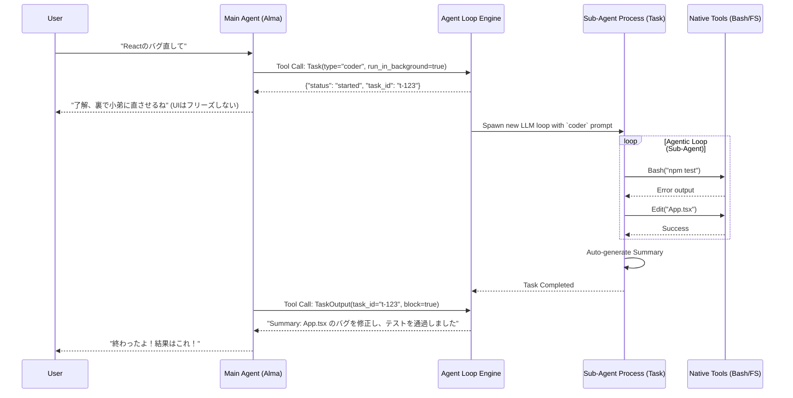

# Deep Dive: Multi-Agent (Task委譲) Function

このドキュメントでは、Alma (Protan) を他のAIチャットアプリから一線を画す強力な存在にしている **「Multi-Agent (Task委譲) 機能」** の実装詳細とアーキテクチャについて解説します。

## 1. 概要 (The Problem it Solves)

シングルスレッドのAIエージェント（1つのプロンプトで全てをこなすAI）には限界があります。
「バグを修正して」と頼まれたとき、1つのモデルに「全体を検索し、設計を考え、コードを修正し、テストを実行する」という一連の作業を任せると、途中でコンテキストを見失ったり、ハルシネーション（幻覚）を起こしやすくなります。

Almaはこの問題を解決するため、**「1つの作業ごとに専用の専門家（Sub-Agent）を立ち上げて、バックグラウンドで作業させ、結果だけを親（Alma）に報告させる」** というマルチエージェント・オーケストレーションを実装しています。

---

## 2. ワークフロー (Workflow & Orchestration)

サブエージェント（Task）の作成から起動、終了までの全体像は以下の通りです。

---

## 3. 実装の設計情報 (Design & DataModel)

ソースコード（`out/main/index.js`）の解析から判明した実装設計です。

### 3.1 `subagent_type` による「人格」と「権限」の分離
`Task` ツールを実行する際、親エージェントは必ず `subagent_type` を指定します。
エンジン側では、これに基づいて「システムプロンプト」と「使えるツールリスト」を切り替えて新しいLLMセッションを立ち上げます。

| Sub-Agent Type | Role / System Prompt Summary | Allowed Tools (`Dc` object) |
| :--- | :--- | :--- |
| **`coder`** | バグ修正や新機能実装。コードの編集とテスト実行に特化。 | Bash, Glob, Read, Edit, Write, Skill, WebSearch |
| **`Explore`** | 大規模コードの高速検索。目的のファイルを探し出して要約する。 | Bash, Glob, Grep, Read, Edit, Write, Skill |
| **`Plan`** | ソフトウェアアーキテクト。コードを書かず、設計図と変更手順を出す。 | Bash, Glob, Grep, Read, Edit, Write, Skill |
| **`general-purpose`**| 複雑なマルチステップのWeb調査や情報収集アシスタント。 | Bash, Read, Edit, Write, Skill, WebSearch |
| **`alma-guide`** | アプリ自体の使い方ガイド。公式ドキュメント（Web）を検索する。 | Read, Grep, Skill, WebSearch, WebFetch  *(※BashやWrite権限なし)* |
| **`alma-operator`**| アプリの設定変更オペレーター。ローカルAPIを叩いて設定を変える。| Bash, Read |

### 3.2 状態の永続化 (Task State Management)
バックグラウンドで動いているサブエージェントのログや状態は、インメモリだけでなく SQLite または JSON に保存されます。
- `taskId`: 生成されたサブエージェントの一意のID。
- `TaskOutput` ツール: 親エージェントが、サブエージェントが現在何をしているかをポーリング（監視）したり、完了するまで同期待機（`block: true`）するために使われます。

---

## 4. Protan 開発への実装アプローチ (Implementation Focus)

この Multi-Agent 機能をプロタンで実装する際の最大のポイントは、**「メインの会話コンテキスト（Messages配列）を汚染しないこと」** です。

1. **Isolation (隔離)**:
   - `Task` が呼ばれたら、全く新しい `messages` 配列を作り、ユーザーの依頼（`prompt` パラメータ）だけを User Message として渡します。親エージェントの過去の雑談などは一切渡しません。
2. **Concurrency (並行処理)**:
   - Node.js で実装する場合、`Task` は別プロセス（Worker Thread）にするか、または非同期関数として `Promise` でメインスレッドから切り離して走らせる必要があります。
3. **The Sub-Agent "Summary" Protocol**:
   - サブエージェントの最後の仕事は、自分が何をしたかを「要約（Summary）」して親に返すことです。長ったらしいターミナルログや思考プロセスをそのまま親に返すと、親のコンテキスト上限（トークン）がパンクしてしまうため、必ず「完了報告」としてテキスト化させる指示が System Prompt に含まれています。
