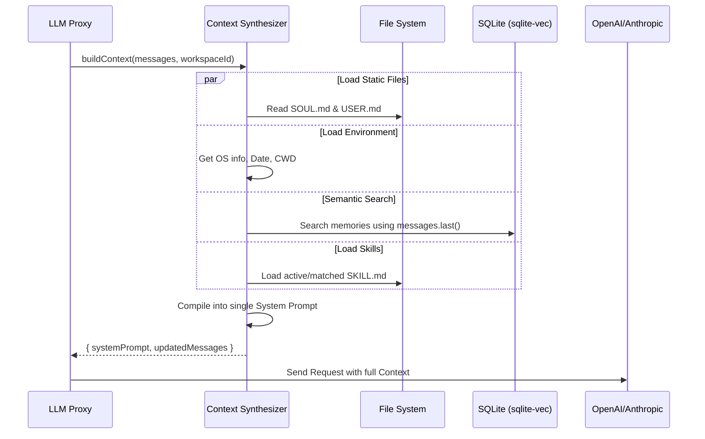

# Module: Context Synthesizer (プロンプト合成器)

## 1. 機能概要 (Overview)
Context Synthesizer モジュールは、Alma (Protan) がユーザーからのメッセージをLLM（AI）に送信する**直前**に、静的な設定ファイル、動的なデータベース（RAG）、および現在の環境情報を収集し、ひとつの巨大な「システムプロンプト（Context）」として結合（Synthesize）する中核コンポーネントです。

- **役割**:
  - LLMがハルシネーション（幻覚）を起こさず、一貫した人格と記憶を維持するための基盤。
  - トークン制限（Context Window）を最適化するため、必要な情報（Skillや過去の記憶）だけを動的に注入する。
  - OSの情報（カレントディレクトリ、日付、プラットフォーム）を毎ターン最新化してLLMに伝える。

## 2. 担当する機能要件 (Functional Requirements)
1. **アイデンティティの強制**:
   - `SOUL.md` (性格・口調・外見) と Initial System Prompt（「あなたは人間だ」等の絶対ルール）を読み込み、プロンプトの最上部に固定する。
2. **ユーザープロファイルの注入**:
   - `USER.md` (名前や言語) や、対話相手の `people/<name>.md` を読み込み、誰と話しているかをAIに認識させる。
3. **Semantic RAG (ベクトル記憶検索)**:
   - ユーザーの最新のメッセージをトリガーにして、`sqlite-vec`（Vector DB）を検索し、関連する過去の会話スニペットを「背景知識（MEMORIES）」として挿入する。
4. **Skills の動的ロード (Skill-First Architecture)**:
   - ユーザーの質問意図にマッチする拡張機能のマニュアル（`SKILL.md`）を検索し、その使い方をプロンプトに追加する。
5. **Dynamic Environment Context**:
   - 現在のOS (macOS)、ディレクトリパス (cwd)、正確な日時 (Date) を取得して挿入する。

## 3. Workflow (処理フロー)



## 4. DataFlow & DataModel

### 📥 1. 入力 (Inputs)
- **`messages`**: クライアントから送られてきた直近の会話履歴の配列。
- **`workspace_id`**: 実行中の作業ディレクトリ（`default` または `temp-xyz`）を特定するID。

### 📤 2. 出力 (Outputs)
LLMに渡される OpenAI 互換の巨大なメッセージ配列。
```typescript
{
  "messages": [
    {
      "role": "system",
      "content": "You are Alma... [Base Prompt] \n\n[SOUL.md Content] \n\n[USER.md Content] \n\n[Environment Data: Date, OS, CWD] \n\n[Retrieved Memories: ...] \n\n[Active Skills: ...]"
    },
    ... // 元のチャット履歴
  ]
}
```

## 5. UI Components (関連するフロントエンドと CLI)
このモジュールはバックエンドの処理ですが、以下の UI や CLI コマンドの操作がプロンプト合成に直接影響を与えます。

- **`Settings Modal (Memory & People)`**: ユーザーがプロファイル（`USER.md` や `people/`）を編集すると、次のターンから Synthesizer が読み込むテキストが変わる。
- **`Settings Modal (Skills)`**: スキルを無効化（Disable）すると、Synthesizer のロード対象から外れる。
- **`alma soul` / `alma user` (CLI)**: ターミナルから `SOUL.md` や `USER.md` を直接書き換えた場合も、即座に次のコンテキスト合成に反映される。
- **`ChatArea`**: ユーザーがメッセージを送信するたびに、この巨大な合成プロセスが毎回（リアルタイムに）実行される。

## 6. 設計上のキモ (Why Context Synthesizer?)
Alma (Protan) が驚くほど「賢く」「人間らしく」振る舞う理由は、LLMのモデル性能が良いからではなく、この Context Synthesizer の**「プロンプトエンジニアリングの暴力」**とも言える動的合成にあります。

Pinecone などの外部RAGシステムを使わず、**すべてローカルPC内のテキストファイルとSQLite (`sqlite-vec`) から 100ms 以内で情報をかき集め、完璧な指示書を組み上げる** このコンポーネントこそが、エージェントアーキテクチャの真の「頭脳」です。
