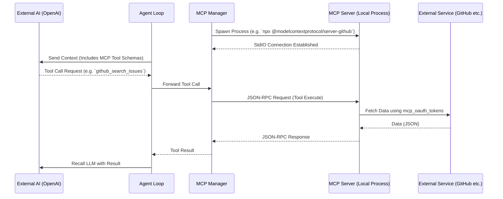

# Module: Extension Manager (Plugins & MCP)

## 1. 機能概要 (Overview)
Extension Manager モジュールは、Alma (Protan) に対して開発者向けの強力な機能追加を提供する、**プラグイン（JavaScript）** と **MCP（Model Context Protocol）サーバー** を管理するためのモジュールです。

- **役割**:
  - `manifest.json` と JS コードを含む本格的な「プラグイン」のインストール、有効化、サンドボックス管理。
  - サードパーティのデータソースやAPI（例: GitHub, Google Drive, ローカルDB等）をエージェントに透過的に繋ぐための「MCPサーバー」のプロセス管理と接続維持。

*(※ ユーザーが Markdown で書く `Skills` は Context Synthesizer 側で処理される軽量な拡張ですが、このモジュールはシステム自体（Node.js / React層）に介入するヘビーな拡張を担います。)*

## 2. 担当する機能要件 (Functional Requirements)

### 🔌 1. Plugin Management (JavaScript 拡張)
1. **インストール & アップデート**: GitHubのURL等からプラグインパッケージをダウンロード（Zip展開/Clone）し、ローカルの `~/.config/alma/plugins/` に配置する。
2. **メタデータと設定管理**: `plugins` および `plugin_settings` テーブルにプラグインの状態（有効/無効、ユーザー設定JSON）を保存する。
3. **サンドボックスと権限**: `plugin_permissions` テーブルを用いて、プラグインがOSのどの機能（ファイル読み書き、ネットワーク通信等）にアクセスできるかを管理する。

### 📡 2. MCP Server Management (Model Context Protocol)
1. **サーバーの登録とプロセス管理**:
   - ユーザーが指定したMCPサーバー（Node.jsスクリプト、Pythonスクリプト、またはSSEエンドポイント）の情報を `mcp_servers` テーブルに保存。
   - バックグラウンドで `child_process` 等を用いてMCPサーバープロセスをスピンアップし、標準入出力（stdio）またはHTTP経由で接続を維持する。
2. **コンテキストの動的ルーティング**:
   - エージェントループ（Agentic Loop）中にLLMが「MCPツール」を呼び出した際、そのリクエストを対象のMCPサーバープロセスに転送し、結果をLLMに返す。
3. **OAuth Token 管理**:
   - `mcp_oauth_tokens` テーブルを用いて、MCPサーバーが必要とする外部API（例: GitHub, Slack）の認証トークンをセキュアに管理する。

## 3. Workflow & DataFlow

## 4. DataModel (DB Schemas)
SQLiteデータベースに格納される、拡張機能管理用のテーブル構造です。

### 🔌 Plugins
- **`plugins`**: `id` (PK), `name`, `version`, `source` (github url), `enabled` (boolean)
- **`plugin_settings`**: プラグイン固有の設定データ (JSON)
- **`plugin_permissions`**: `plugin_id`, `permission_key`, `granted` (boolean)

### 📡 MCP (Model Context Protocol)
- **`mcp_servers`**: `id` (PK), `name`, `command` (e.g. "npx"), `args` (JSON), `env` (JSON), `status`
- **`mcp_oauth_tokens`**: `server_id`, `access_token`, `refresh_token`, `expires_at`

## 5. UI Components (関連するフロントエンド)
このモジュールに依存する UI は以下の通りです。

- **`MCPSettings` (Settings Modal)**: MCPサーバーの登録フォーム、ステータス（接続中/エラー）表示インジケーター、OAuth認証のフロー開始ボタン。
- **`PluginsSettings` (Settings Modal)**: GitHub URL からのプラグインインストールボタン、有効化/無効化のトグルスイッチ、権限（Permissions）の承認モーダル。
- **`Tool Execution Indicator`**: エージェントがMCPサーバーのツールを実行している際に「🔌 外部データソースを検索中...」と表示するUI。

## 6. Protan 開発への実装アプローチ (Implementation Focus)
1. **MCP (Model Context Protocol) の完全統合**:
   - Anthropic社が提唱する最新のプロトコルであるMCPに対応することは、次世代のAIエージェントにとって必須条件です。このモジュールを実装することで、開発者はエージェント自体のコードをいじることなく、世の中に無数にある「MCP対応サーバー」をポン付けするだけで、プロタンに Slack, Notion, GitHub などを直接操作させることができるようになります。
2. **プロセス管理の堅牢性**:
   - Node.js で `child_process.spawn` して立ち上げた多数のMCPサーバープロセスが、プロタンの終了時（プロセスKill時）にゾンビ化しないよう、確実なクリーンアップ処理（Graceful Shutdown）を実装する必要があります。
