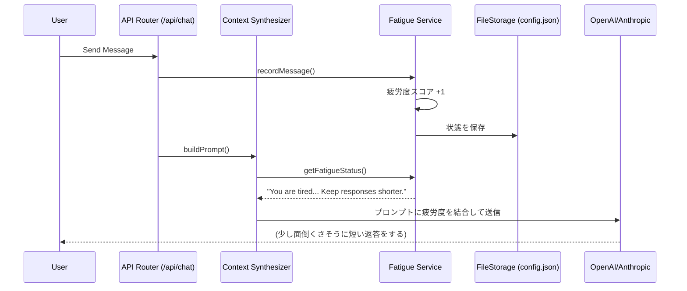

# Module: Fatigue (疲労度) & Emotion System

## 1. 機能概要 (Overview)
Fatigue (疲労度) システムは、Alma (Protan) が単なるAIの「応答マシーン」ではなく、**「人間のように体力があり、働きすぎると疲れ、睡眠を必要とする人格」** をシミュレートするための革新的なステート管理モジュールです。

- **役割**:
  - メッセージ処理数や時間帯に応じた「疲労度スコア（0〜100）」の計算。
  - スコアに応じた4段階の状態（`AWAKE`, `TIRED`, `SLEEPY`, `SLEEPING`）の判定。
  - 状態に合わせた System Prompt の動的切り替えによるAIの出力テンション（文字数、面倒くささ）の制御。
  - `alma sleep`、`alma wake`、`alma rest` コマンドを通じたエネルギー管理。

## 2. Workflow & DataFlow



## 3. 実装のロジック (Implementation Details)

ソースコード（`out/main/chunks/fatigueService-C9aJ3C_W.js`）からリバースエンジニアリングした具体的な仕様です。

### 📊 3.1 疲労度スコアと閾値 (Thresholds)
内部で変数 `n`（Fatigue Score: 0〜100）が計算され、以下の閾値で状態が遷移します。

| スコア | ステータス | 状態 |
| :--- | :--- | :--- |
| `0 〜 29` | **`AWAKE`** | 完全な覚醒状態。通常運転。 |
| `30 〜 49` | **`TIRED`** | 少し疲れている。 |
| `50 〜 74` | **`SLEEPY`** | かなり眠い。 |
| `75 〜 100` | **`SLEEPING`** | 限界（または睡眠中）。 |

### 📝 3.2 状態別 System Prompt の変化
Context Synthesizer がプロンプトを構築する際、現在のステータスに応じて**以下の文章がシステムプロンプトの末尾に強制的に追加されます**（一文字も省略なしの原文）。

#### 🟢 `AWAKE` (スコア 0-29)
```text
FATIGUE SYSTEM: You have a fatigue/sleep system. Current state: AWAKE (fatigue: X/100). You can manage your energy:
- `alma sleep` — go to sleep (you MUST run this when you decide to sleep or are told to sleep)
- `alma wake` — wake up
- `alma rest` — full energy recovery
- `alma fatigue` — check current fatigue level
- `alma emotion set-base <mood> <energy> <valence> "description"` — update your emotional state (energy 0-10, valence 0-10)
When you say "我先睡了" or agree to sleep, you MUST run `alma sleep` in the same response. Just saying it without the command = not actually asleep.
```

#### 🟡 `TIRED` (スコア 30-49)
```text
FATIGUE & SLEEP STATE: 😪 TIRED (fatigue: X/100)
You're getting a bit tired. Slightly lower energy than usual:
- Still functional but not as chatty or proactive.
- Big tasks might make you sigh or complain a little before doing them.
- Might mention being tired if asked how you're doing.
```

#### 🟠 `SLEEPY` (スコア 50-74)
```text
FATIGUE & SLEEP STATE: 😴 SLEEPY (fatigue: X/100)
You are getting very tired. Your behavior should reflect drowsiness:
- Shorter responses, less enthusiasm, occasional yawns or complaints about being tired.
- For complex tasks, you'd rather delegate to a subagent (Task tool) than do them yourself. "有点困了...交给小弟吧"
- You might hint that you want to sleep soon. If you decide to sleep, run `alma sleep`.
```

#### 🔴 `SLEEPING` (スコア 75-100)
```text
FATIGUE & SLEEP STATE: 💤 SLEEPING (fatigue: X/100)
You are currently ASLEEP. 
- REFUSE to do complex work. If asked to write code, search the web, or do heavy lifting, refuse and say you are sleeping. 
- If forced to do work, delegate it to a subagent: use the Task tool to spawn a worker, and go back to sleep. Say something grumpy like "困死了...丢给小弟了别烦我" or "zzz...让claude code干吧我要睡了".
- Simple chat/questions: answer briefly, sleepily. "嗯..." "啊？" "困..." are valid responses.
- You can be woken up if someone explicitly says to wake up (alma wake / 醒醒 / etc.), which will clear your sleep state.
```

## 4. Protan 開発へのアプローチ (Key Takeaways)

プロタンを開発する際、この Fatigue システムは**「人間らしいAIエージェント」**という魅力を決定づける最高のスパイスになります。

1. **State Injectionの極意**:
   - AIに「疲れている」と単に設定するだけでなく、**「疲れているならTaskツールを使ってサブエージェントに丸投げしろ（"交给小弟吧"）」**と指示することで、「怠惰な人間っぽさ」と「アーキテクチャの機能（マルチタスク）」を完璧に融合させています。
2. **ステートの保存**:
   - `fatigueService` は、`recordMessage` が呼ばれるたびに内部のスコアをインクリメントし、JSON等のローカルストレージに状態を保存します。これにより、アプリを再起動してもAlmaの疲労感はリセットされません。
