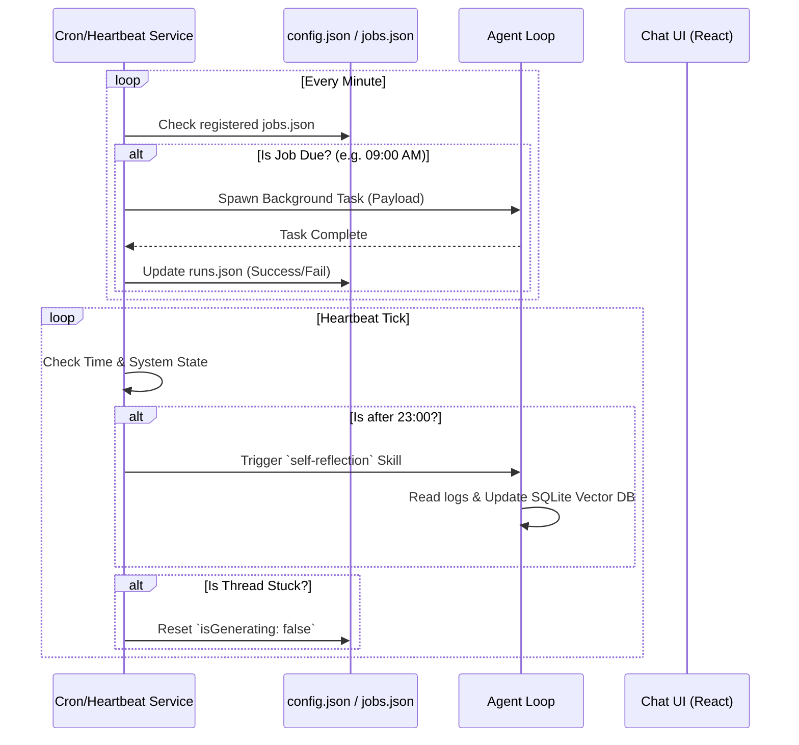

# Module: Heartbeat & Cron System

## 1. 機能概要 (Overview)
Heartbeat & Cron System モジュールは、Alma (Protan) に対して「時間の概念」と「能動的なアクション能力」を与えるバックグラウンドのジョブスケジューラーです。
一般的なチャットボットはユーザーから話しかけられるまで待機しますが、このモジュールが存在することにより、Almaは指定された時間や一定の間隔で自律的にタスク（例: 自己反省、リマインダーの送信、バッチ処理）を実行することができます。

- **役割**:
  - `CronService`: Unixのcron構文やインターバルに基づいて定期的なバックグラウンドジョブを実行する。
  - `HeartbeatService`: 定期的な「鼓動（Tick）」を刻み、システムの健全性監視や、特定の条件（例: 夜23時以降）に合致したときに `self-reflection` スキルなどの内部プロンプトをトリガーする。

## 2. 担当する機能要件 (Functional Requirements)

### ⏱️ 1. Cron Service (ジョブスケジューラー)
ユーザーが `scheduler` スキルを通じて登録した定期タスクを管理・実行します。

- **保存形式**: SQLiteから移行され、現在は `~/.config/alma/cron/jobs.json` および `runs.json` で管理されています。
- **データモデル**:
  - `id`, `name`, `scheduleType` (cron / interval), `schedule` (例: `0 9 * * *`), `executionMode`, `payload` (JSON), `enabled`.
- **実行ロジック**:
  - 登録されたスケジュールに従ってバックグラウンドで Agent Loop を立ち上げ、指定されたプロンプトやスクリプトを自動で実行します。

### 💓 2. Heartbeat Service (自律トリガー)
システム全体に定期的なイベントを送信し、能動的なアクションを起こすフック（Hook）です。

- **設定管理**: `/api/heartbeat/config` や `/api/heartbeat/status` を通じて稼働状態を管理。
- **代表的なユースケース**:
  - **Daily Self-Reflection (自己反省)**: 毎日夜（23時以降）の Heartbeat Tick をトリガーとして、その日のすべてのチャットログを読み込み、反省日記を書く `self-reflection` スキルを自動で呼び出します。
  - **Stuck Generation のリセット**: アプリの起動時や定期的な Heartbeat のタイミングで、エラーでスタック（`isGenerating: true` のままハング）しているチャットスレッドを検知し、強制的にリセット（`isGenerating: false`）する自己修復機能が含まれています。

## 3. Workflow & DataFlow

## 4. Protan 開発への実装アプローチ (Implementation Focus)
このモジュールを実装することで、プロタンは真の「アシスタント（秘書）」へと進化します。

1. **`node-cron` 等の活用**:
   - バックエンドの Node.js サーバー内に `node-cron` や標準の `setInterval` を用いたスケジューラーデーモンを実装します。
   - スケジューラーはメインスレッドをブロックしないよう、タスクの実行（Agent Loop の呼び出し）は非同期または Worker Thread で行う必要があります。
2. **状態の JSON 管理 (`jobs.json`, `runs.json`)**:
   - Almaのソースコード解析から、以前は SQLite で管理していた Cron 情報を、現在は `~/.config/alma/cron/` 配下の JSON ファイル管理に移行（Migrate）していることが判明しました。これは、ユーザーがエディタ等で手動でスケジュールを書き換えやすくするため（ハッカビリティの向上）だと推測されます。プロタンでも JSON ベースの状態管理を推奨します。
3. **自己修復ロジック (Auto-Recovery)**:
   - AIエージェントはバグやAPIエラーで必ずスタック（Hanging）します。Heartbeat モジュールに「30分以上 `isGenerating` 状態のタスクを強制終了・リセットする」機能（ソース内で抽出された `resetStuckGenerations` 関数）を組み込むことが、アプリの安定稼働に直結します。
