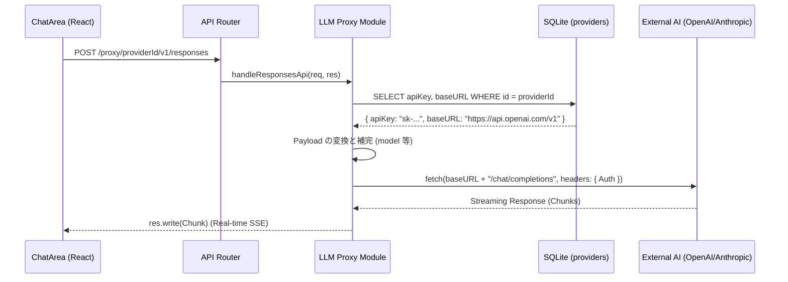

# Module: LLM Proxy (AI Provider Proxy)

## 1. 機能概要 (Overview)
LLM Proxy モジュールは、Alma (Protan) のバックエンド（Express Server）に常駐し、ユーザー（UI/CLI）から送信されたチャットメッセージを安全に外部のAIプロバイダー（OpenAI, Anthropic等）へ転送（中継）する役割を担います。

- **役割**:
  - APIキーなどのクレデンシャル情報の保護（UI側に持たせない）。
  - OpenAI互換API、Anthropic独自API、Google Gemini、ローカルOllamaなど、複数プロバイダーのAPI差異を吸収するアダプターパターン。
  - ストリーミングレスポンス（Server-Sent Events: SSE）の安全なパイピング（Pipe）。
  - クライアント側のリクエストに含まれない「モデル」や「プロンプト」の自動補完・フォールバック。

## 2. 担当する機能要件 (Functional Requirements)
1. **エンドポイントの動的解決 (Dynamic URL Routing)**:
   - 指定された `providerId` から SQLite DB を引き当て、そのプロバイダーの `type` (例: `openai`) に基づいて転送先の `baseURL` を決定する。
2. **認証情報 (API Key) の動的注入**:
   - リクエストヘッダー (`Authorization: Bearer sk-...`) にデータベースから取得したAPIキーを安全に挿入する。
3. **Payload Adaptation (ペイロード変換)**:
   - プロバイダーごとに異なるリクエスト形式（例: Anthropicの `messages` 構造）へ JSON を変換する。
4. **Streaming Forwarding (ストリーム転送)**:
   - LLMからのチャンク単位のレスポンス（SSE）を、Node.js の `fetch` ストリームを通して Express の `res` オブジェクトへリアルタイムに書き出す（Pipe）。

## 3. Workflow & DataFlow



## 4. DataModel (API 入出力スキーマ)

このモジュールが取り扱うデータの型定義です。

### 📥 1. 入力 (Request from UI)
UIからは、プロバイダーを特定するIDと、一般的な OpenAI 互換の Chat Completion ペイロードが送られてきます。
```typescript
{
  "providerId": "uuid-string", // パスパラメータ
  "model": "gpt-4o",           // 任意。指定がなければDBのデフォルトを使用
  "messages": [
    { "role": "user", "content": "こんにちは" }
  ],
  "stream": true,
  "tools": [...]               // Tool Call スキーマ
}
```

### 📤 2. 出力 (Response to UI)
OpenAI または Anthropic から返却される生の SSE ストリームをそのまま返します。
```text
data: {"id":"chatcmpl-123","object":"chat.completion.chunk","choices":[{"delta":{"content":"こん"}}]}
data: {"id":"chatcmpl-123","object":"chat.completion.chunk","choices":[{"delta":{"content":"にちは"}}]}
[DONE]
```

## 5. UI Components (関連するフロントエンド)
このモジュールに依存する UI および CLI は以下の通りです。

- **`ChatArea` / `ChatInput`**: メッセージ送信時、ユーザーがヘッダーの「Model Selector」で選んだプロバイダーのIDを含めて `POST /proxy/:providerId/...` を直接叩く。
- **`Model & Provider Selector`**: UI上で「OpenAI」から「Anthropic」へ切り替えた瞬間、裏側で叩くProxyエンドポイントのURLが動的に変更される。
- **`alma chat` (CLI)**: ターミナルからチャットする際も、このProxyモジュールを経由して通信する。

- **`Settings Modal (Providers & Models)`**: プロバイダーの API キーを登録・テスト・削除するための画面。
- **`alma provider add` (CLI)**: ターミナルから新しいプロバイダーを追加・編集し、DB に登録する。
- **`alma provider-key` (CLI)**: 登録済みの API キーを取得・表示（一部マスク処理）する。
## 6. Adapter Pattern (アダプター実装のキモ)
外部プロバイダーごとに API リクエスト/レスポンス形式が異なるため、LLM Proxy にはプロバイダー固有のアダプターが実装されています。

- **`OpenAI` / `OpenRouter`**: 標準の `chat/completions` フォーマットをそのまま転送。
- **`Anthropic (Claude)`**: `/anthropic-proxy/.../messages` へ転送する際、リクエストの `messages` を Anthropic 独自の形式に変換（Systemプロンプトの分離など）する。
- **`Google (Gemini)`**: `type == "google"` の場合、専用の `ai()` メソッド等を通してリクエストを Google API 形式に変換し、ストリームをパースして UI へ中継する。

このアダプター層により、UIやAgent Loop層は「自分が今どのプロバイダーと話しているか」を全く気にせず、標準化された OpenAI フォーマットでチャットを送信するだけで済む設計になっています。
