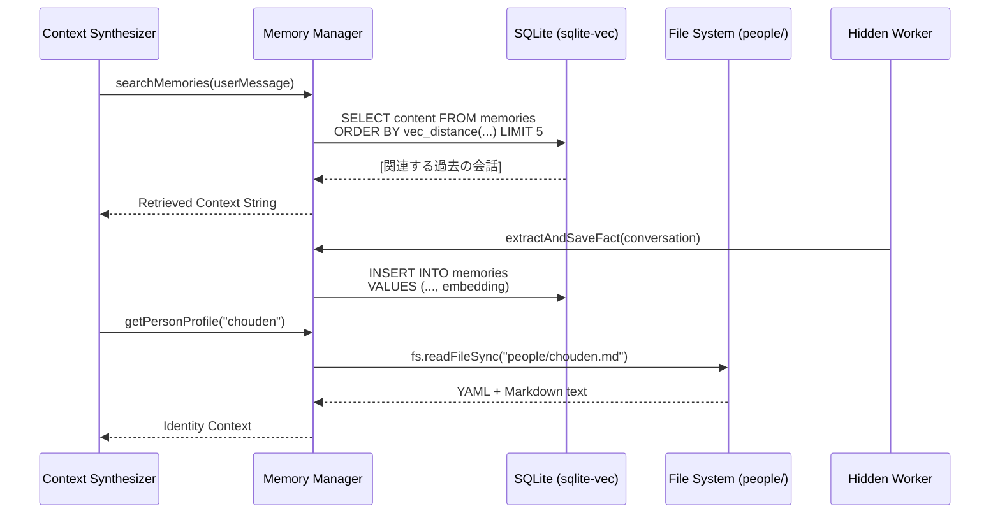

# Module: Memory Manager (RAG & Identity Service)

## 1. 機能概要 (Overview)
Memory Manager モジュールは、Alma (Protan) の**「長期記憶」と「人格（アイデンティティ）」**を管理するデータ層（Service）です。
ユーザーから投げられたチャットメッセージに対して、リアルタイムで関連する過去の会話を検索（Semantic Search）したり、ユーザーの個人的な事実（Profile）を更新したりする役割を持ちます。

- **役割**:
  - `sqlite-vec` によるローカルでの完全オフラインなベクトル検索 (RAG: Retrieval-Augmented Generation)。
  - `~/.config/alma/people/<name>.md` などの物理ファイル（YAML Frontmatter）を通じた確実な人物プロファイルのCRUD操作。
  - バックグラウンドワーカー（Hidden Prompts）からの呼び出しによる、不要になった「テンポラリメモリ（短期記憶）」の自動クリーンアップ。

## 2. 担当する機能要件 (Functional Requirements)
1. **Semantic RAG (ベクトル記憶検索)**:
   - チャット送信時に、最新のメッセージ文脈をクエリとして `sqlite-vec`（`memory_embeddings` テーブル）を検索し、上位の関連する記憶テキストを返す。
2. **Memory Extraction (記憶の抽出と保存)**:
   - ユーザーとの会話終了後など、バックグラウンドでLLMに「この会話から長期的に覚えるべき個人の好みや事実だけを抽出しろ」と命令し、結果を `sqlite-vec` に INSERT（または UPDATE）する。
3. **Structured Profile Management (人物プロファイル)**:
   - AIが他のユーザーと混同（ハルシネーション）しないよう、`name`, `discord_id`, `telegram_id` 等の情報を物理ファイル（Markdown + YAML）で管理・提供する。

## 3. Workflow (処理フロー)



## 4. DataModel & Schemas

### 🗄️ 1. Vector Memory Database (SQLite)
`sqlite-vec` プラグインを用いた、ローカルでの RAG データベーススキーマ。

```sql
-- 記憶のメタデータと本文
CREATE TABLE memories (
    id TEXT PRIMARY KEY,
    content TEXT NOT NULL,
    type TEXT,
    metadata TEXT, -- JSON (thread_id, timestamp)
    created_at TEXT NOT NULL
);

-- 1536次元のベクトルインデックス (OpenAI text-embedding-3-small 互換)
CREATE VIRTUAL TABLE memory_embeddings USING vec0(
    memory_id TEXT PRIMARY KEY,
    embedding FLOAT[1536]
);
```

### 📄 2. Structured Profile (Markdown + YAML)
`~/.config/alma/people/<name>.md` に保存される人物データのフォーマット。

```yaml
---
telegram_id: "123456789"
discord_username: "someone"
---
# About This Person
- Works as a software engineer.
- Prefers Python over Go.
```

## 5. UI Components (関連するフロントエンド)
このモジュールに依存する UI と CLI コマンドです。

- **`MemorySettings` (Settings Modal)**:
  - ユーザーが手動で記憶データベースの統計（`stats`）を見たり、過去の全スレッドから Embeddings を再構築（`Rebuild`）するプログレスバーを表示するパネル。
- **`PeopleSettings` (Settings Modal)**:
  - ユーザー自身（`USER.md`）や、対話相手のプロファイルを直接GUIから編集できるフォーム。
- **`alma memory search` (CLI)**:
  - ターミナルから直接、過去の自分の会話をセマンティック検索（キーワードではなく「意味」で検索）できるコマンド。

## 6. Protan 開発への実装アプローチ (Implementation Focus)
1. **`sqlite-vec` のビルドと導入**:
   - SQLiteにベクトル検索の拡張モジュールを組み込むのはネイティブバイナリのビルド（`node-gyp`等）が絡むため、環境構築（Docker/macOS）で一番つまづきやすいポイントです。
2. **Embedding API の呼び出し**:
   - テキストをベクトル（数字の配列）に変換するために、データを SQLite に入れる直前に必ず `POST https://api.openai.com/v1/embeddings` を叩くレイヤー（またはローカルの `Ollama` 連携）を挟む必要があります。
3. **Pinecone 不要の強み**:
   - これが実装できれば、外部の有料ベクタデータベース（PineconeやWeaviate）が一切不要になり、**「ユーザーのPC内で完全に完結する無料のプライベートRAG」** が実現します。
