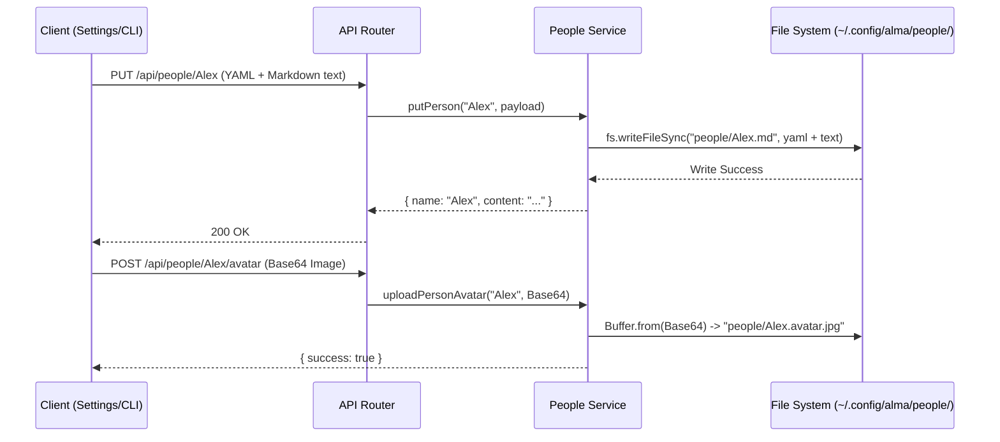

# Module: People Profiles (人物プロファイル機能)

## 1. 機能概要 (Overview)
People Profiles モジュールは、Alma (Protan) がユーザー自身やグループチャットの参加者を正しく認識し、「Aさんの趣味とBさんの趣味を混同する」といったAI特有のハルシネーション（幻覚）を防ぐための**確実な記憶（Fact Storage）**システムです。

- **役割**:
  - `~/.config/alma/people/<name>.md` をベースにした人物プロファイル（名前、プラットフォームID、好み、属性など）の作成と管理。
  - プロファイルのテキストデータと、メタデータ（YAML Frontmatter）の解析。
  - ユーザーや第三者のアバター画像の管理（例: `<name>.avatar.jpg`）。
  - ベクトル記憶（RAG）とは独立した、プロンプトへの「確実な事実」の注入。

## 2. 担当する機能要件 (Functional Requirements)
1. **プロファイルの CRUD 操作**:
   - `GET /api/people` : 登録されている全人物のリストを取得。
   - `GET /api/people/:name` : 特定の人物の Markdown データを取得。
   - `PUT /api/people/:name` : 人物のデータを新規作成、または上書き更新する。
   - `DELETE /api/people/:name` : 人物の `.md` ファイルとアバター画像群を削除する。
2. **アバター（顔写真）の管理**:
   - `POST /api/people/:name/avatar`: base64エンコードされた画像を受け取り、`<name>.avatar.jpg` として保存。
   - DiscordやTelegramなどのプラットフォームごとに異なるアイコン (`avatar.discord.jpg`, `avatar.telegram.jpg`) にも対応している。
3. **YAML Frontmatter のパース**:
   - `gray-matter` 等を用いて、Markdownファイルからメタデータ（例: `telegram_id: "123456789"`）とテキスト本文を分離・結合する。

## 3. Workflow & DataFlow



## 4. DataModel (File Schema)

このモジュールはRDB（SQLite）を使用せず、すべてファイルシステム上でデータを管理します。

### 📄 プロファイルファイル (`<name>.md`)
ファイルの先頭に YAML Frontmatter を持ち、その下に Markdown 本文が続きます。
これにより、プログラマティックにIDを検索できつつ、AIがそのままプレーンテキストとして読める構造を実現しています。

```yaml
---
telegram_id: "123456789"
discord_id: "987654321"
feishu_id: "ou_xxxxx"
username: "alex_dev"
---
# About Alex
- 職業: フロントエンドエンジニア
- 言語: 主に日本語で話す
- 好み: ReactとTailwindCSSを好む
```

### 🖼️ アバター画像
- `~/.config/alma/people/<name>.avatar.jpg` (デフォルト)
- `~/.config/alma/people/<name>.avatar.discord.jpg` (Discord連携時など)

## 5. Protan 開発への実装アプローチ (Implementation Focus)

1. **RAG (Vector DB) との使い分け**:
   - 雑談の文脈は `sqlite-vec` (Memory Manager) に投げますが、「ユーザーのID」や「嫌いなもの」といった絶対に間違えてはいけない事実は、この People Profiles に保存します。
   - プロンプト合成器（Context Synthesizer）は、チャット相手が特定できた場合、**RAGの検索結果よりも優先して、この `<name>.md` の中身を System Prompt の上部に強制注入**します。

2. **プラットフォーム連携 (IM Bridge) との相性**:
   - プロタンを Telegram や Discord のBotとして動かす際、送られてきたメッセージの `user_id` と、このプロファイル内の `telegram_id` をマッチングさせることで、AIは**「今自分に話しかけてきているのが誰か」**を正確に認識できます。
