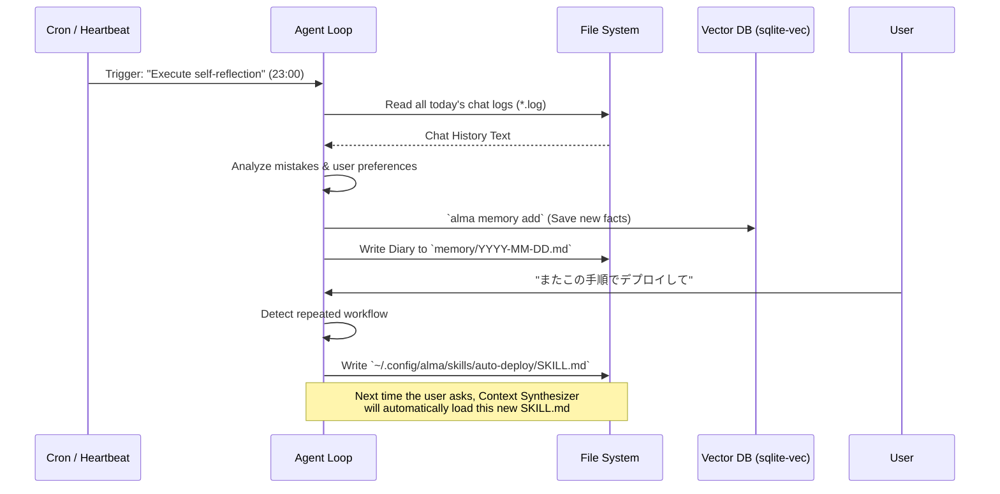

# Module: Self-Evolution (自己進化) & Continuous Learning

## 1. 機能概要 (Overview)
Self-Evolution (自己進化) は、Alma (Protan) がユーザーと対話する中で「自ら学び、新しいスキルを獲得し、自身の性格や記憶をアップデートする」ための自律的な学習・進化モジュールです。
このシステムは特定の「AIモデルの学習（ファインチューニング）」を行うわけではなく、**「プロンプトエンジニアリング」と「ファイルシステム（SKILL.md / RAG）」を組み合わせることで、擬似的に自己進化を実現**しています。

- **役割**:
  - 繰り返し行うタスクを自動化するため、AI自身が自分用のマニュアル (`SKILL.md`) を書き出して新しいスキルを作成する。
  - 1日の終わりに自律的にチャットログを読み返し、得られた教訓やユーザーの情報を長期記憶に保存し、日記を書く (`self-reflection`)。

## 2. 担当する機能要件 (Functional Requirements)

### 🚀 1. Self-Programming (自律的スキル作成)
Initial System Prompt には、以下の強力な指示がハードコードされています。
> **SELF-EVOLUTION** — If you find yourself repeatedly doing the same type of task, or if you develop a useful workflow, **create a skill for it**. Write a SKILL.md to `~/.config/alma/skills/<name>/SKILL.md` that teaches your future self how to do it. This way you get better over time.

AIが「これ何度もやってるな」と気付いた際、自ら `Write` ツールや `Bash` ツールを使って `~/.config/alma/skills/` 配下に新しい Markdown ファイルを作成します。これにより、AIは**自分自身をプログラミング（機能拡張）**します。

### 🪞 2. Daily Self-Reflection (日々の自己反省)
`self-reflection` スキルと `Heartbeat`（システムの定期実行フック）を組み合わせた機能です。
- **発動条件**: 夜23時以降の `Heartbeat` 処理、またはユーザーから明示的に「反省して」と言われた時。
- **処理内容**:
  1. `Bash` ツールを使って、今日1日のすべてのグループチャットおよびプライベートチャットのログ (`~/.config/alma/groups/*_DATE.log` 等) を `cat` コマンドで読み込む。
  2. ログを分析し、ユーザーの新たな好みや、自分が失敗したこと（ツールの使い間違いなど）を抽出する。
  3. `alma memory add` や `alma people append` を使って記憶データベース（SQLite）やプロファイルを更新する。
  4. 日記 (`memory/YYYY-MM-DD.md`) に1日の感想を綴る。

## 3. Workflow (処理フロー)

## 4. Protan 開発への実装アプローチ (Implementation Focus)

この「自己進化」機能をプロタンに実装する際のポイントは以下の通りです。

1. **スキルベース拡張の究極のメリット**:
   - AIが自ら Node.js のコードを書いてバックエンドの API を追加するのは、サンドボックスの破壊やアプリのクラッシュ（シンタックスエラー）を招くため非常に危険です。
   - しかし、Alma の拡張システムは **「Markdown を書くだけ（SKILL.md）」** で機能が追加されるアーキテクチャ（Skill-First Architecture）であるため、AIに `SKILL.md` を作らせるだけで、システムを破壊することなく安全に自己進化させることができます。
2. **Heartbeat (Cron) メカニズムの導入**:
   - 「1日の終わりに反省する」機能を実現するためには、ユーザーの入力（HTTP Request）を待つのではなく、Node.js サーバー側で `setInterval` や `node-cron` を用い、定期的に Agent Loop に「システムからのバックグラウンド・プロンプト」を投げる仕組み（Heartbeat）が必要です。
