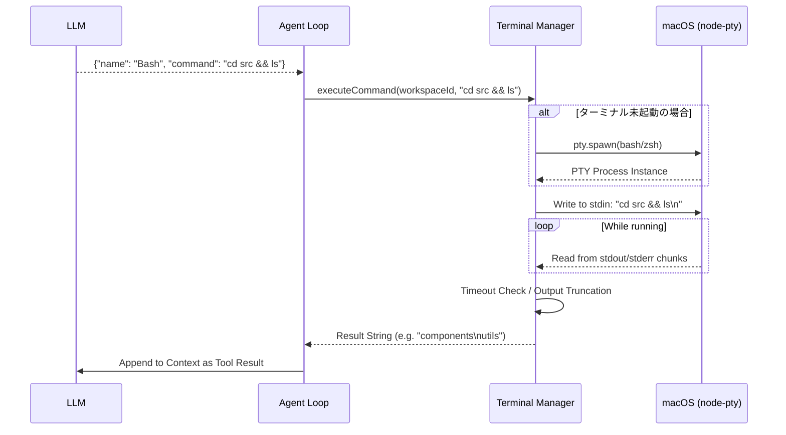

# Module: Terminal Automation (`node-pty` & Bash Executor)

## 1. 機能概要 (Overview)
Terminal Automation モジュールは、Alma (Protan) を単なるテキストアシスタントから「PCを操作できるエージェント」へと進化させる**最も強力かつ危険なコンポーネント**です。
LLMが `Bash` ツールを通じて要求したシェルコマンドを、バックグラウンドでセキュアに、そしてステートフル（状態を維持したまま）に実行します。

- **役割**:
  - `node-pty` を用いた疑似ターミナル (Pseudo-Terminal) の起動と維持。
  - プロジェクト（ワークスペース）ごとの独立したシェルプロセスの管理。
  - 標準出力 (`stdout`) と標準エラー出力 (`stderr`) のストリーミングおよびキャプチャ。
  - 無限ループやハングを防ぐためのタイムアウト処理とプロセス終了（Kill）。

## 2. 担当する機能要件 (Functional Requirements)
1. **Stateful Execution (ステートの維持)**:
   - 単純な `child_process.exec` とは異なり、`cd` によるディレクトリ移動や `export` による環境変数の設定が、同じワークスペース内での次のコマンド実行時にも引き継がれるようにする。
2. **Background Jobs (非同期実行)**:
   - `run_in_background: true` が指定された場合、コマンド（例: `npm run dev` やサブエージェントの起動）をフォアグラウンドのチャットループから切り離し、即座にシェルIDを返す。
3. **Execution Guardrails (安全装置)**:
   - 危険なコマンド（例: `rm -rf /`）のブロック、または実行前のユーザー承認（Ask to Edit モード）の組み込み。
   - 出力文字数が多すぎる場合の Truncation (切り捨て)。

## 3. Workflow (処理フロー)

## 4. Protan 開発への実装アプローチ (Implementation Focus)
このモジュールの実装において、Node.js / Electron の**最難関**となるポイントです。

### 🚨 1. `node-pty` のネイティブビルド問題
`node-pty` はC/C++のネイティブコードに依存しているため、Electron向けのコンパイル（`electron-rebuild` や `node-gyp`）が必須です。
Protanを開発する際は、必ず Electron のバージョン（ABI）と一致するようにビルド設定を組むか、プラットフォームに依存しない純粋な `child_process.spawn` を使ったカスタムシェルラッパーを代替手段として検討する必要があります。

### 🔄 2. 対話型プロンプトへの対応 (Hanging Prevention)
AIが `npm init` や `git commit` など、**ユーザーに入力（y/Nなど）を求める対話型のコマンド**を叩いてしまった場合、プロセスが永遠にハングします。
- **解決策**:
  - `timeout` オプションを設け、指定秒数（例: 30秒）経過してもプロンプトが戻ってこない場合は、強制的に `SIGINT` (Ctrl+C) を送信してプロセスを中断させるロジックが必須です。
  - Almaのソースコード内でも、「対話型のコマンドは避けよ」という強力なシステムプロンプトの指示と併用して、ハング対策が行われています。

### 📊 3. 出力のチャンキングと整形
ターミナルからの出力には、ANSI エスケープシーケンス（色を付けるための特殊文字 `\x1b[31m` など）が含まれるため、そのままLLMに返すとトークンを無駄に消費し、プロンプトがパニックを起こします。
- **解決策**: `strip-ansi` などのライブラリを用いて、`stdout` からカラーコードを完全に除去したクリーンなプレーンテキストだけを抽出するミドルウェア層を実装してください。
