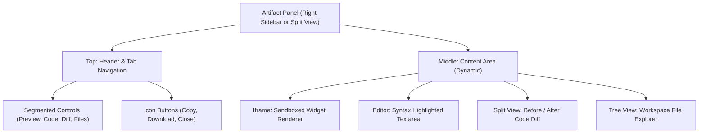

# UI Component: `ArtifactPanel` (プレビュー・作業領域)

## 1. 機能概要 (Overview)
`ArtifactPanel` コンポーネントは、Alma (Protan) のチャット画面の右側に展開（または画面分割）される拡張領域です。
AIが生成したコードのプレビュー（ウィジェットやグラフ等）や、ファイル変更の差分（Diff）、現在のワークスペースのファイルツリーを表示する役割を担います。

- **役割**:
  - `widgetRenderer` 等で生成された HTML/SVG のセキュアな描画 (Sandboxed Iframe)。
  - 生成された生のコード（Markdown / CodeBlock）のハイライト表示。
  - サブエージェント（`coder`）がコードを修正した際の前後の差分（Git Diff風）の表示。
  - ワークスペース内のファイルをツリー表示し、中身を確認できるファイラ。

## 2. Props (入力データとイベント)

### 📥 状態 (State Props)
- `isOpen` (boolean): パネルが現在展開されているかどうか。
- `activeTab` (string): 現在選択されているタブ（`preview`, `code`, `diff`, `files`）。
- `artifactContent` (object): AIから受け取ったHTML文字列やコードブロックの生データ。
- `workspaceId` (string): 現在の作業ディレクトリ（`temp-xxx` 等）。

### 📤 イベント (Event Callbacks)
- `onClose`: パネルを閉じる（非表示にする）。
- `onTabChange`: タブを切り替える。
- `onMessageFromIframe`: Iframe内のウィジェットから送られてきた `send-prompt` などの `postMessage` イベントを親（ChatArea）へ中継する。

## 3. UIの構成要素とレイアウト (Layout & Components)

## 4. 🧩 主要なUI部品（Sub-Components）

### 🎨 1. `WidgetRenderer` (Preview Tab)
- `sandbox="allow-scripts allow-same-origin allow-popups"` 属性が付与された `<iframe>`。
- AIが生成した HTML/JS をこの Iframe に流し込み、アプリと同じCSS変数（テーマ）を適用して描画します。
- `window.addEventListener('message')` でIframeからのリサイズ要求（`widget-resize`）を受け取り、Iframe自体の高さを自動調整します。

### 💻 2. `CodeViewer` (Code Tab)
- `shiki`（または `prismjs`）を用いて、生成された生のソースコードをシンタックスハイライト付きで表示します。
- 行番号（Line Numbers）の表示と、ワンクリックでのコード全体コピー機能（Clipboard API）を備えます。

### 🔄 3. `WorkspaceDiffViewer` (Diff Tab)
- 左側に「変更前（赤色背景）」、右側に「変更後（緑色背景）」のコードを並べて表示するGitスタイルの差分ビューア。
- `coder` サブエージェントが裏でファイルを書き換えた際に、ユーザーが「どこがどう変わったか」を視覚的にレビュー・承認するために使用します。

### 📁 4. `WorkspaceFilesPicker` (Files Tab)
- 現在のワークスペースディレクトリ（例: `/Users/.../workspaces/temp-xxx/`）に存在するファイル群をツリー状に表示するエクスプローラー。
- クリックすると、そのファイルの中身を `CodeViewer` に渡して閲覧できるようにします。

## 5. Protan 開発への実装アプローチ (Implementation Focus)
フロントエンド開発における、このパネルの「最大のUXポイント」は以下の通りです。

1. **シームレスなトランジション（アニメーション）**:
   - `framer-motion` などのアニメーションライブラリを用い、パネルが開く際やタブが切り替わる際に、チャット画面を押し出すような滑らかなスライドアニメーション（Spring）を実装します。
2. **Iframe のセキュリティと Context Isolation**:
   - ReactのメインコンテキストとIframeのコンテキストを完全に隔離してください。AIが悪意あるJSを生成しても、親ウィンドウ（ElectronのNode環境）には絶対にアクセスできない設計（Sandbox）が必須です。
3. **Resize Observer の活用**:
   - 画面幅が狭い場合（モバイルやウィンドウ縮小時）、2カラムではなく「チャットの上にオーバーレイするモーダル（BottomSheet等）」に自動で切り替わるレスポンシブな設計（`useMediaQuery` 等）が求められます。
