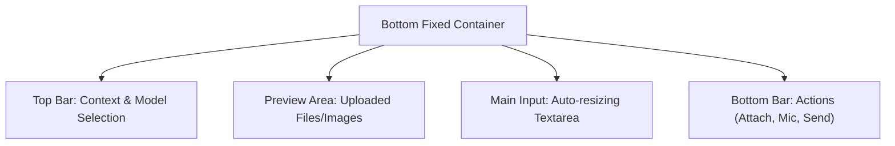

# UI Component: `ChatInput` (チャット入力領域)

## 1. 機能概要 (Overview)
`ChatInput` コンポーネントは、ユーザーがAIエージェント（Alma）に対してメッセージ、ファイル、画像、音声などを入力し、送信するためのインターフェースです。
単なるテキストエリアではなく、AIモデルの切り替え、ツール使用の許可/拒否、添付ファイルのプレビュー、音声文字起こし（Whisper）の制御など、複数のコントロールが集約された複合コンポーネントです。

- **役割**:
  - マルチライン（複数行）のテキスト入力と送信。
  - 画像、PDF、コードなどのファイル添付とプレビュー表示。
  - マイク入力からのリアルタイム音声文字起こし。
  - AI応答中のストリーミングの強制停止（Stop）。
  - 使用するAIプロバイダーやモデルの動的切り替え。

## 2. Props (入力データとイベント)

### 📥 状態 (State Props)
- `value` (string): 現在入力されているテキスト。
- `isStreaming` (boolean): AIが現在応答を生成中かどうか（送信ボタンをStopボタンに切り替えるため）。
- `attachments` (File[]): ユーザーがドラッグ＆ドロップなどで追加した添付ファイルのリスト。
- `selectedModel` / `selectedProvider`: 現在選択されているAIモデルとプロバイダー。
- `isRecording` (boolean): マイクでの音声入力中かどうか。

### 📤 イベント (Event Callbacks)
- `onSend`: `(text: string, files: File[]) => void`
  - 入力されたテキストと添付ファイルをバックエンド (`/api/chat/completions`) に送信する。
- `onStop`: AIのストリーミング応答やツールの無限ループを強制終了させる。
- `onUploadFile`: ファイルピッカーを開くか、クリップボードからのペーストを処理する。
- `onToggleMic`: 音声入力を開始/停止する。
- `onModelChange`: 使用するモデル（例: `gpt-4o` -> `claude-3.5-sonnet`）を切り替える。

## 3. UIの構成要素とレイアウト (Layout & Components)

画面下部に固定（Sticky）されるコンテナ内で、以下の要素が配置されています。

### 🎨 コンポーネントツリー (Layout)

### 🧩 主要なUI部品（Sub-Components）

#### 1. トップバー (Context Controls)
- **`ModelSelector` (Dropdown)**: 左上に配置。現在のプロバイダーのアイコンとモデル名を表示し、クリックで変更可能なドロップダウンメニュー。
- **`ToolStatusToggle` (Icon/Switch)**: エージェントがネイティブツール（Bash等）を使うことを許可するかどうかのトグルスイッチ（セーフモード）。

#### 2. プレビューエリア (Attachment Preview)
- ユーザーがファイルをドロップすると、入力欄の上部にサムネイルとして表示されます。
- **`ImageThumbnail`**: 画像ファイルの場合、リサイズされたプレビュー画像と「✖️（削除）」ボタン。
- **`FileCard`**: PDFやコードファイルの場合、ファイル名とアイコン（拡張子に応じたもの）を表示する小さなカードUI。

#### 3. メイン入力欄 (TextArea)
- **`AutoResizeTextArea`**: 入力されたテキストの長さに応じて、最大高さ（例: 画面の40%）まで自動的に縦に広がるテキストエリア。
- **ショートカット対応**: `Enter` で送信、`Shift + Enter` で改行。設定（Settings）でこの挙動を入れ替えるオプションが存在します。
- **Paste Event Handler**: クリップボードに画像がある状態で `Cmd + V` を押すと、自動的に `attachments` に追加されます。

#### 4. アクションボタン群 (Bottom Bar)
入力欄の下（または右端）に配置されるコントロールです。
- **`Attach Button` (📎 ＋ アイコン)**: OSのファイルダイアログを開くボタン。
- **`Mic Button` (🎤 マイクアイコン)**:
  - クリックで録音開始。録音中はアイコンが赤色（点滅）に変わり、「Listening...」というステータスバーが表示される。
  - もう一度クリックで録音終了。裏で Pythonベースの `Whisper` エンジンが走り、音声がテキスト化されて TextArea に自動入力される。
- **`Send / Stop Button`**:
  - 平常時 (Send): 紙飛行機アイコン（または ↑ アイコン）。テキストかファイルが存在する時のみアクティブ（青色等）になる。
  - ストリーミング時 (Stop): 停止アイコン（⏹️ 赤色）。クリックすると `AbortController` が発火し、バックエンドの生成ループ（Agentic Loop）を強制終了する。

## 4. Protan 開発への実装アプローチ (Implementation Focus)

フロントエンド開発において、このコンポーネントは**「操作感の要」**となります。

1. **ドラッグ＆ドロップ (D&D) の実装**:
   - `react-dropzone` 等のライブラリを用いて、アプリ全体のどこにファイルをドロップしても、この `ChatInput` にファイルが吸い込まれるようなグローバルなD&Dハンドラを実装する必要があります。
2. **IME (日本語入力) への対応**:
   - 日本語入力中に `Enter` 確定をした際に、誤ってメッセージが送信（`onSend`）されないよう、`e.nativeEvent.isComposing` を判定して送信ブロックをかける処理が**絶対に必要**です。
3. **Pasting Images (クリップボードからの画像ペースト)**:
   - `onPaste` イベントをフックし、`e.clipboardData.files` を読み取ってブラウザの `File` オブジェクトとして `attachments` 配列に挿入するロジックを実装します。
