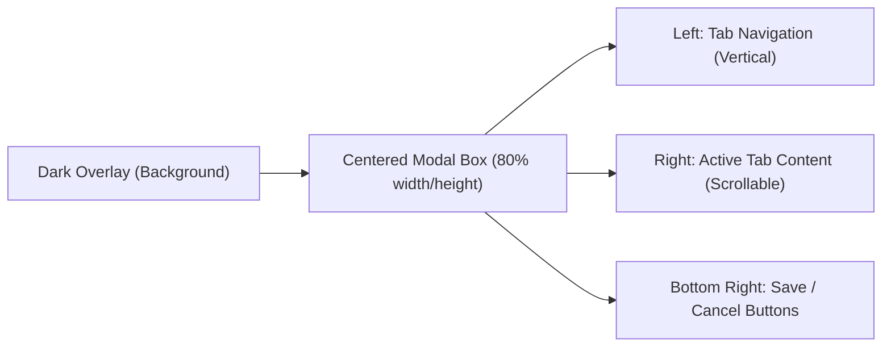

# UI Component: `SettingsModal` (グローバル設定画面)

## 1. 機能概要 (Overview)
`SettingsModal` コンポーネントは、Alma (Protan) の「脳」や「外部接続」に関するあらゆる設定を一元管理するための巨大なモーダルウィンドウです。
APIキーの登録から、ローカルTTSエンジンのダウンロード、メモリデータベースの再構築、Botの常駐設定まで、システムの根幹に関わる操作をUIから直感的に行えるようにします。

- **役割**:
  - バックエンドAPI (`/api/settings`, `/api/providers`, `/api/skills` 等) との同期・CRUD操作。
  - 複雑な設定項目をカテゴリ別の「タブ (Tabs)」に分割して整理・表示。
  - プロンプトインジェクション（Skills, People Profile）のグラフィカルな編集インターフェース。

## 2. 全体レイアウト (Layout)

## 3. 主要なタブと構成要素 (Tabs & Sub-Components)

設定モーダルの左側にあるタブをクリックすると、右側のコンテンツエリアが以下のコンポーネントに切り替わります。

### ⚙️ 1. `GeneralSettings` (一般・UI設定)
- **言語・テーマ**: 言語（en/ja/zh）のドロップダウン、Dark/Lightテーマの切り替えトグル。
- **フォントサイズ・ショートカット**: チャット画面の文字サイズ調整、グローバルショートカットキー（例: `Cmd+Shift+Space` でAIを呼び出す）のバインディング入力欄。
- **起動設定**: OSログイン時の自動起動トグル。

### 🔌 2. `ProviderSettings` (AIモデル・プロバイダー)
- **プロバイダーリスト**: 画面左半分に登録済みのプロバイダー（OpenAI, Anthropic, Ollama等）のリストカード。
- **編集フォーム**: 
  - `Base URL` (Input): カスタムエンドポイント。
  - `API Key` (Password Input): 目玉アイコン付きのシークレット入力欄。
- **アクションボタン**:
  - `Test Connection`: バックエンド (`POST /api/providers/:id/test`) を叩いて、緑（成功）か赤（失敗）のトースト通知（Sonner）を出す。
  - `Fetch Models`: APIから利用可能なモデル一覧を自動取得し、下にチェックボックスリストとして展開する。

### 🧠 3. `MemorySettings` (記憶・RAG管理)
- **データベース統計**: `sqlite-vec` に保存されている総記憶数、DBファイルサイズの表示。
- **Rebuild Embeddings**: 
  - プロバイダーやモデルを変更した際に、過去の記憶を新しいベクトル空間で作り直すための危険なボタン（赤色）。
  - クリックするとプログレスバー（`progress` ステート）が表示され、バックエンドからの SSE/WebSocket イベントで「何件中何件処理完了」がリアルタイム更新される。

### 👤 4. `PeopleSettings` (人物プロファイル)
- **プロフィールリスト**: Almaが記憶している人物（自分自身 `USER.md` を含む）の一覧。
- **Markdownエディタ**: その人物の「絶対に間違えてはいけない情報（ID、趣味など）」をYAML Frontmatter + Markdown形式で直接編集できるテキストエリア。

### 🌟 5. `SkillsSettings` & `PluginsSettings`
- **インストール済みリスト**: 有効/無効（Enable/Disable）を切り替えるトグルスイッチ付きのカードリスト。
- **Install from GitHub**: リポジトリのURLを入力し、「Install」ボタンを押すと、バックエンドが裏で `git clone` してリストに追加される。

### 🤖 6. `IntegrationsSettings` (Bot常駐)
- Telegram, Discord などのタブ。
- `Bot Token` 入力欄と、`Allowed User IDs` のタグ入力フィールド。
- 画面上部のトグルスイッチで、Botのバックグラウンド稼働（Polling/Webhook）をON/OFFする。

## 4. Protan 開発への実装アプローチ (Implementation Focus)

このコンポーネントは機能が非常に多いため、**状態管理（State Management）**と**コンポーネントの遅延読み込み（Code Splitting）**がパフォーマンスの鍵になります。

1. **Jotai（軽量ステート管理）の活用**:
   - `config.json` やプロバイダーの一覧など、アプリ全体で使い回すデータは Jotai の `atom` に入れておき、モーダルを開いた瞬間にキャッシュから瞬時に描画させます。
2. **保存（Save）のタイミング**:
   - リアルタイム保存（トグルを切り替えた瞬間に `PUT /api/settings` を叩く）と、手動保存（画面下の「Save」ボタンで一括送信）のUI/UXを明確に分ける必要があります。プロバイダーのAPIキーなどはリアルタイム保存（Auto-save）が推奨です。
3. **React.lazy / Suspense**:
   - 設定画面には「Markdownエディタ」や「グラフ描画」など重いライブラリが含まれるため、タブの中身（`GeneralSettings`, `ProviderSettings` 等）はユーザーがクリックして初めて JavaScript をロードする `React.lazy` で分割（Code Split）する設計が必須です。
