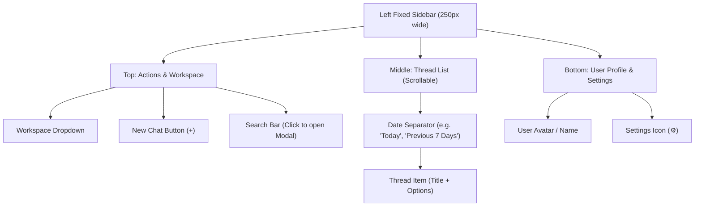

# UI Component: `Sidebar` (ナビゲーション・サイドバー)

## 1. 機能概要 (Overview)
`Sidebar` コンポーネントは、アプリの左端に配置され、ユーザーが過去の会話（スレッド）にアクセスしたり、作業中のワークスペース（プロジェクト）を切り替えたりするためのナビゲーション領域です。

- **役割**:
  - 新規チャットの作成（New Chat）。
  - 現在のワークスペース（`default` または `temp-xxx`）の表示と切り替え。
  - 過去のチャット履歴（Thread List）の時系列表示と選択。
  - 履歴のベクトル検索（Global Search Modal）の呼び出し。
  - グローバル設定画面（Settings Modal）への入り口。

## 2. Props (入力データとイベント)

### 📥 状態 (State Props)
- `threads` (Array): API (`GET /api/threads`) から取得した過去のチャットスレッドのリスト。各アイテムは `id`, `title`, `updatedAt` などを持ちます。
- `activeThreadId` (string): 現在開いているチャットスレッドのID（ハイライト表示用）。
- `workspaces` (Array): 利用可能なワークスペースのリスト。
- `activeWorkspaceId` (string): 現在選択されているワークスペースのID。

### 📤 イベント (Event Callbacks)
- `onNewChat`: 新規チャットボタンが押された時の処理（現在のコンテキストをクリアし、新しい `threadId` を発行する）。
- `onSelectThread(id)`: リスト内の過去のスレッドがクリックされた時の処理（そのスレッドの履歴をロードする）。
- `onDeleteThread(id)`: スレッドの削除ボタン（ゴミ箱アイコン）が押された時の処理。
- `onOpenSettings`: 設定ボタン（歯車アイコン）が押された時の処理（`SettingsModal` を開く）。
- `onOpenSearch`: 検索バーがクリックされた時の処理（`ThreadSearchModal` を開く）。

## 3. UIの構成要素とレイアウト (Layout & Components)

## 4. 🧩 主要なUI部品（Sub-Components）

### 🏷️ 1. `WorkspaceSelector` (Top)
- 現在の作業領域（`temp-xxx` 等）を表示するドロップダウン。
- ワークスペースを切り替えると、チャットのコンテキストやファイルシステムがそのプロジェクトディレクトリに完全に切り替わります。

### 🔍 2. `ThreadSearchModal` (Triggered from Search Bar)
- 検索バーをクリックすると画面中央に開く、MacのSpotlight (Cmd+K) のようなモーダル。
- ユーザーがキーワードを入力すると、バックエンドの `sqlite-vec`（ベクトルDB）を叩いて過去のチャット履歴から該当する発言やスレッドを高速に探し出し、リスト表示します。

### 📜 3. `ThreadItem` (Middle)
- `threads` 配列を「今日」「昨日」「過去7日間」などでグルーピングして表示するリストアイテム。
- `ThreadTitle`: バックエンドの隠しプロンプト（`thread-title-generation`）によって自動生成された短いタイトルが表示されます。
- `Hover Actions`: アイテムにマウスオーバーすると、スレッド名の編集（Rename）や削除（Delete）の小さなアイコンボタンが現れます。

## 5. Protan 開発への実装アプローチ (Implementation Focus)

1. **Jotai / SWR を用いたキャッシュ管理**:
   - サイドバーの `threads` リストは頻繁に更新される（新しいメッセージを送るたびに `updatedAt` が変わる）ため、グローバル状態管理（Jotai）やデータフェッチライブラリ（SWR/React Query）を使って、チャット画面とサイドバー間で状態を同期（キャッシュの更新）させる設計が必要です。
2. **Infinite Scroll (無限スクロール)**:
   - 長期間アプリを使っているとスレッドの数が数百〜数千に膨れ上がるため、`MessageList` と同様に `react-virtuoso` 等を用いた仮想スクロール、または Intersection Observer を用いたページネーション (`limit`, `offset`) を実装してAPIを叩く必要があります。
3. **レスポンシブデザイン (Mobile/Narrow View)**:
   - ウィンドウの幅が狭い場合、サイドバーは隠れて「ハンバーガーメニュー（≡）」になり、クリック時のみ左からスライドイン（Drawer/Offcanvas）するモバイルライクな挙動（Tailwindの `md:hidden` 等）が必要です。
