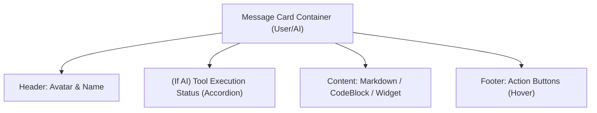

# UI Component: `VirtualizedMessageList` (チャット履歴表示)

## 1. 機能概要 (Overview)
`VirtualizedMessageList` は、ユーザーとAIエージェントの会話履歴（Messages）を表示する、プロタン（Alma）フロントエンドの中で最も重要なUIコンポーネントの一つです。
LLMからストリーミングされるマークダウン、コードブロック、生成されたウィジェット（Artifacts）、およびAIが裏で実行しているツール（Bash等）のステータスをリアルタイムにレンダリングします。

- **役割**:
  - メッセージのレンダリング（ユーザーの入力、AIのテキスト返答、ツールの実行結果）。
  - 大量にログが溜まった場合でもUIがカクつかないための **Virtualization（仮想スクロール）**。
  - AIがストリーミングで応答を生成している最中のオートスクロール（Auto-scroll to bottom）。

## 2. Props (入力データとイベント)

抽出されたソースコードから判明した主要な Props は以下の通りです。

### 📥 状態 (State Props)
- `messages`: 会話履歴の配列（role, content, tool_calls 等を含む）。
- `threadId`: 現在表示しているスレッドのID。
- `threadModel`: このスレッドで現在使用されているAIモデル（UI上でアイコン等を表示するため）。
- `isLoading` / `freezeStreamingMessage`: AIが現在応答を生成・ストリーミング中かどうかのフラグ。
- `subagentMessages`: バックグラウンドで動いているサブエージェント（`Task` ツール）の途中経過メッセージ。
- `retrievedMemories`: 今回のターンでRAG（ベクトル検索）によって引き当てられた「記憶」のリスト（ユーザーに「この記憶を思い出したよ」と表示するため）。
- `toolAnalysisSelectedTools` / `skillAnalysisSelectedSkills`: 現在AIが使用しようと判断したツールやスキルのリスト（UI上のステータス表示用）。

### 📤 イベント (Event Callbacks)
- `onEditRequest`: ユーザーが過去の自分の発言を編集して再送信（分岐）する時のコールバック。
- `onBranchRequest`: メッセージの途中から新しいスレッドとして分岐（Branch）させる機能。
- `onRetryStart`: エラーが起きたAIの応答を再生成（Retry）させる。
- `onRollbackRequest`: 過去の特定のメッセージ時点まで会話を巻き戻す（Rollback）機能。
- `onScroll` / `onUserScrollIntent`: ユーザーが過去のログを読もうと上にスクロールした際、ストリーミング中の強制一番下スクロールを停止するための判定イベント。

## 3. Workflow & Interactions (UIの挙動)

1. **ストリーミングとオートスクロール**:
   - AIが返答を生成している最中は、`messages` の最後の要素がミリ秒単位で更新（チャンクが追加）され続けます。
   - コンポーネントは自動的に一番下までスクロールし続けますが、ユーザーがマウスで上へスクロール（`onUserScrollIntent`）した瞬間、オートスクロールは一時停止します。
   - `AT_BOTTOM_THRESHOLD = 50`（一番下から50px以内の位置にいる時だけオートスクロールを再開する仕組み）がハードコードされています。

2. **ツール実行ステータスの表示**:
   - `messages` 配列の中に、単なるテキストではなく `tool_calls`（例: "Bashを実行中"）が含まれていた場合、テキストバブルの代わりに「ローディングアニメーション付きの専用コンポーネント（Tool Execution Indicator）」を描画します。

3. **ブランチとロールバック (Time Travel)**:
   - ユーザーが過去のAIのメッセージにカーソルを合わせると、「Rollback（ここに戻る）」や「Retry（再生成）」ボタンが現れます。
   - クリックすると、`onRollbackRequest` イベントが発火し、バックエンドに対して「このメッセージ以降の履歴を削除して」という API リクエスト (`/api/threads/:id/compact` 等) が飛ぶ仕組みになっています。

## 4. Protan 開発への実装アプローチ (Implementation Focus)
フロントエンドを開発する際、このコンポーネントは **「Reactの再レンダリング最適化の鬼門」** となります。

- **Virtuoso などの仮想リストライブラリの利用**:
  何百往復もしたチャットログを通常の `map` でレンダリングすると、DOM要素が膨大になりアプリがフリーズします。名前に `Virtualized` と付いている通り、画面に見えている範囲（Viewport）のメッセージだけを描画する設計が必須です。
- **MarkdownとShikiの重さ回避**:
  AIが書くコードブロック（Markdown）は、`react-markdown` や `shiki`（シンタックスハイライト）で描画されますが、非常に重い処理です。すでに過去のメッセージは `React.memo` を使って完全にキャッシュ（再描画を防ぐ）し、**「現在ストリーミングで追記されている最後のメッセージ」だけをピンポイントで再レンダリングする設計**にしなければなりません。

## 5. UIの構成要素とレイアウト (Layout & Components)
`VirtualizedMessageList` 内の個々のメッセージ（吹き出し）は、以下のような要素とレイアウトで構成されています。

### 🎨 メッセージバブルのレイアウト

### 🧩 主要なUI部品（Sub-Components）
- **`MessageHeader`**: ユーザーまたはAlmaのアバター画像と名前を表示します。
- **`Tool Execution Indicator` (Accordion/Dropdown)**: AIが `tool_calls` を返した際、「🔍 Web検索中...」「💻 ターミナル実行中...」といったステータスをスピナー（ローディングアイコン）と共に表示します。クリックするとアコーディオンが開き、実際のターミナルログ（stdout）が流れる領域（`TerminalOutputPreview`）が展開されます。
- **`MarkdownRenderer`**: メッセージのテキスト部分。`react-markdown` を用いてテーブル、リンク、太字などをレンダリングします。
- **`CodeBlock`**: Markdown内のコード部分。`shiki` を使ってシンタックスハイライトされ、右上に「Copy」ボタンと「Run（もし実行可能な言語なら）」ボタンが配置されます。
- **`WidgetContainer` (Iframe)**: `widgetRenderer` ツールが呼ばれた場合、このメッセージカード内にインラインで透過Iframeが埋め込まれ、動的UI（グラフ等）が表示されます。
### 🔘 アクションボタン群 (Message Footer / Hover Menu)
メッセージにマウスオーバー（Hover）した際に表示されるコントロール群です。
- **`Copy` ボタン**: メッセージの生テキストをクリップボードにコピー。
- **`Edit` ボタン**: ユーザーの発言を再編集するテキストエリアに切り替える。
- **`Retry` ボタン (AIのみ)**: この返答から下を破棄して、別の回答を再生成させる。
- **`Play TTS` ボタン (🔊 音声アイコン)**: クリックするとローカルTTSエンジンでテキストを読み上げる。
- **`Rollback` ボタン (↺ 時計アイコン)**: 「この時点まで会話を巻き戻す」操作。
