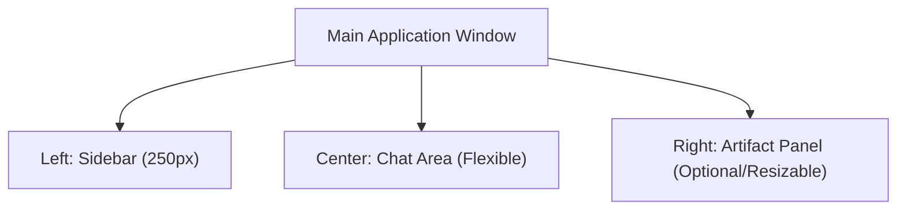

# UI Design Spec: 01 Main Chat Screen (メインチャット画面)

## 1. 画面の目的
ユーザーがAlma（AIエージェント）と対話する主要なインターフェース。
ターミナル操作やタスクの進行状況の確認、LLMモデルの切り替えなど、日常的な操作のすべてをここで行います。

## 2. 全体レイアウト (3-Column Layout)
画面は左から「Sidebar（履歴とナビゲーション）」「Chat Area（対話領域）」「Artifact Panel（プレビュー領域・トグル式）」の最大3カラム構成になります。

## 3. UI要素と配置 (Wireframe)

### 【Left】 Sidebar (サイドバー)
- **Top:** 
  - `Workspace Selector` (Dropdown): 現在のプロジェクト（例: default, temp-xxx）を切り替える。
  - `New Chat` (Button / Icon): 現在のコンテキストをリセットし、新しいチャットを開始する。
  - `Thread Search` (Input / Button): 過去の履歴をベクトル検索するための検索バー（クリックでモーダル展開）。
- **Middle (Scrollable):**
  - `Thread List` (List): 過去のチャット履歴が日付やトピック順に並ぶ。各アイテムには `Title` と `Date` が表示される。
- **Bottom:**
  - `User Profile` (Avatar): ユーザーのアイコン。
  - `Settings` (Icon: ⚙️): グローバル設定モーダルを開くボタン。

### 【Center】 Chat Area (対話領域)
- **Header (Top):**
  - `Thread Title` (Text/Input): LLMが自動生成したタイトル。クリックでリネーム可能。
  - `Model & Provider Selector` (Dropdown): 現在会話しているモデル（例: Claude 3.5 Sonnet, GPT-4o）を即座に切り替える。
  - `Fatigue / Emotion Indicator` (Badge/Icon): Almaの現在の疲労度や感情（例: 🔋 Awake, 😪 Tired）を表示するステータスバッジ。
- **Message List (Middle, Scrollable):**
  - `User Message` (Bubble - Right): ユーザーのテキストや添付ファイル。
  - `AI Message` (Bubble - Left): AlmaからのMarkdown応答。
    - `Tool Execution Status` (Collapsible Component): AIが裏で `Bash` や `WebSearch` を実行している際、「🔍 検索中...」「💻 ターミナル実行中...」というローディングUIが表示され、クリックで実際のログ（stdout）を展開できる。
    - `Message Actions` (Hover Menu): メッセージに対する Copy, Edit, 再生成、そして **Play TTS** (🔊 音声読み上げ) ボタン。
- **Chat Input (Bottom):**
  - `Attach` (Icon: 📎): 画像やファイルをコンテキストに追加。
  - `Mic` (Icon: 🎤): Whisperによる音声入力。
  - `Prompt Input` (Textarea): 複数行対応の入力欄。
  - `Send / Stop` (Button): 送信ボタン。AIの生成中やTaskの実行中は `Stop` (⏹️) に切り替わる。

## 4. デザイナーへの指示・ポイント
- **Agentic Feel (エージェント感)**: 単なるチャットではなく、AIが「今裏で何をしているか（Tool Execution Status）」がユーザーに伝わるUIが必要です。ターミナルログがリアルタイムで流れるような小窓（Collapsible）のデザインが重要です。
- **Fatigue UI**: Almaが「疲れている」ことを視覚的に表現するインジケーター（顔文字やバッテリーアイコン等）をヘッダーに配置してください。
