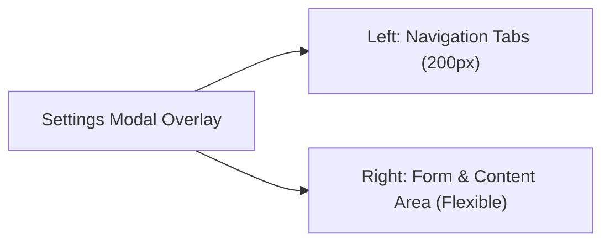

# UI Design Spec: 02 Global Settings Modal (グローバル設定画面)

## 1. 画面の目的
AIのプロバイダー、メモリ（RAG）の管理、スキルの追加、外部Bot（Telegram/Discord）の連携など、アプリの「脳」と「拡張機能」をすべて管理するための巨大なモーダルウィンドウです。

## 2. 全体レイアウト (2-Column Modal Layout)
画面の中央にオーバーレイ表示される大きなモーダル。左側に設定カテゴリのタブメニュー、右側に各カテゴリの詳細フォームが配置されます。

## 3. UI要素と配置 (Wireframe)

### 【Left】 Navigation Tabs (カテゴリメニュー)
縦並びのリストメニュー。以下のカテゴリが並びます。
- `General` (UI・言語・テーマ)
- `Providers & Models` (APIキー・モデル管理)
- `Memory & People` (記憶・人物プロファイル)
- `Skills & MCP` (拡張機能)
- `Integrations` (Bot連携)
- `Advanced` (ChromeRelay・システム)

### 【Right】 Content Area (カテゴリ別の詳細フォーム)

#### 画面A: Providers & Models
- `Provider List` (Sidebar / Cards): 登録済みのプロバイダー（OpenAI, Anthropic, Custom等）のリスト。
- `Add Provider` (Button): 新規プロバイダーを追加。
- **Provider Details:**
  - `API Key` (Password Input): 「sk-...」形式で入力するフィールド。
  - `Base URL` (Input): カスタムエンドポイント用。
  - `Fetch Models` (Button): APIを叩いて最新モデル一覧を取得するアクションボタン。
  - `Enabled Models` (Multi-select / Checklist): 取得したモデルの中でUIに表示させるものを選択。

#### 画面B: Memory & People
- **Vector Memory (sqlite-vec) Section:**
  - `Stats` (Text): 現在の記憶数やDBサイズの表示。
  - `Rebuild Embeddings` (Button/Progress Bar): 過去ログからベクトルを再構築する重い処理のUI。
- **People Profiles Section:**
  - `People List` (Table/Cards): 記憶している人物名とアイコンの一覧。
  - `Profile Editor` (Form): 名前、SNSのID（Telegram ID等）、趣味などのMarkdown/YAMLを編集するテキストエリア。

#### 画面C: Integrations (Bot連携)
- `Telegram Bot` (Section):
  - `Bot Token` (Password Input): TelegramのBotFatherから取得したトークン。
  - `Allowed User IDs` (Input/List): Almaと会話を許可するTelegramのユーザーIDリスト。
  - `Start/Stop Bot` (Toggle): Botの稼働状態を切り替える。

## 4. デザイナーへの指示・ポイント
- **情報量の整理**: かなりギークで高度な設定が多いため、アコーディオン（折りたたみ）やTooltip（`?` アイコン）を活用して、各設定項目の意味（「MCPとは？」など）を補足できるようにしてください。
- **API Keyの安全性**: APIキーの入力欄はデフォルトで伏せ字（`***`）にし、目玉アイコンで表示切替ができるスタンダードなセキュアUIにしてください。
