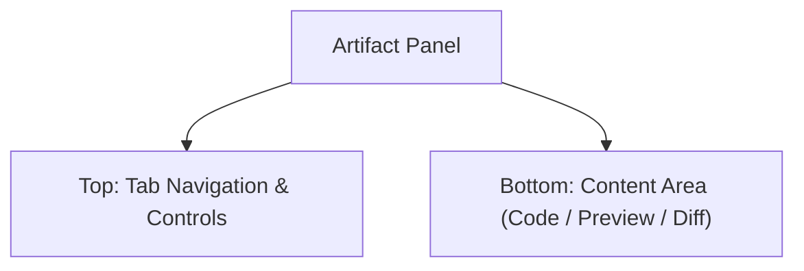

# UI Design Spec: 03 Artifact & Workspace Panel (プレビュー・作業領域)

## 1. 画面の目的
サブエージェント（`coder` 等）が書いたコードの差分を確認したり、AIが生成したグラフ（PieChart）やUIウィジェット（HTML/SVG）をリアルタイムでプレビューするための領域です。

## 2. 全体レイアウト (Right Sidebar / Split View)
メインチャット画面の右側にスライドして展開される、または画面を左右に分割（Split）する形で表示されます。

## 3. UI要素と配置 (Wireframe)

### 【Top】 Header (タブとコントロール)
- `Close` (Icon: ✖️): パネルを閉じて元のチャット画面のみに戻す。
- `View Tabs` (Segmented Control):
  - `Preview` 🎨: HTMLやSVGの実際のレンダリング結果を表示。
  - `Code` 💻: 生成された生のソースコード（React, HTML, Python等）を表示。
  - `Diff` 🔄: ファイルが修正された場合、変更前後の差分を表示。
- `Copy / Download` (Icon Buttons): 生成物をクリップボードにコピーしたり、ファイルとして保存する。

### 【Bottom】 Content Area (ビュー別の表示領域)

#### View A: Preview (プレビュー表示)
- `Iframe / Canvas`: AIが `widgetRenderer` や `pieChart` ツールで生成したコードを、安全なサンドボックス環境（Iframe等）で実際に実行・描画するエリア。グラフのホバーアクションなどが動作します。

#### View B: Code (コード表示)
- `Code Editor / Viewer` (Syntax Highlighted Textarea): Shiki 等を用いてシンタックスハイライトされたコードを表示。可能であれば行番号を表示。

#### View C: Diff Viewer (差分表示)
- `Split Diff Component`: 左側に「変更前（赤背景）」、右側に「変更後（緑背景）」のコードを並べて表示するGitスタイルの差分ビューア。`coder` エージェントが作業した結果をユーザーがレビューするために使用します。

#### View D: Workspace Files Picker (ファイルエクスプローラー)
- `File Tree` (Tree View): 現在のワークスペース（`temp-xxx` 等）内に存在するディレクトリとファイルの構造をツリー状に表示。クリックでそのファイルの中身を Code View で確認できる。

## 4. デザイナーへの指示・ポイント
- **Claude Artifactsのような体験**: Anthropicの「Artifacts」UIを参考に、チャットの文脈を邪魔せずに横でリッチなコンテンツが開くシームレスなアニメーションとデザインを意識してください。
- **Diffの視認性**: AIが勝手にコードを書き換えるため、どこがどう変わったか（Diff）を一目で人間がレビュー・承認できるような、クリアな色使い（赤・緑の明度調整）が求められます。
