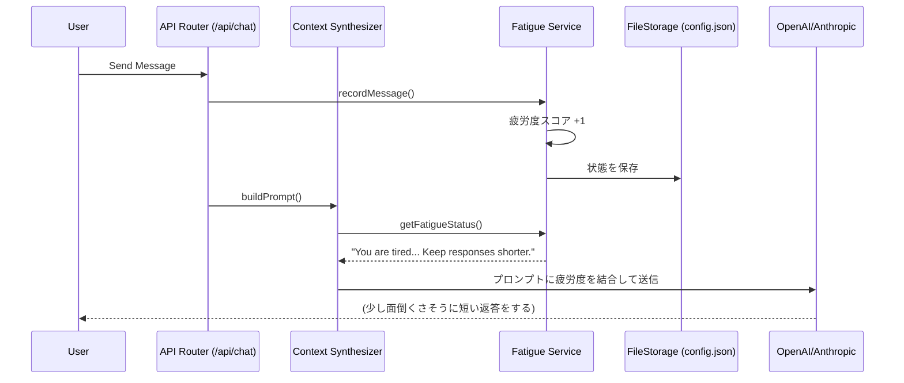
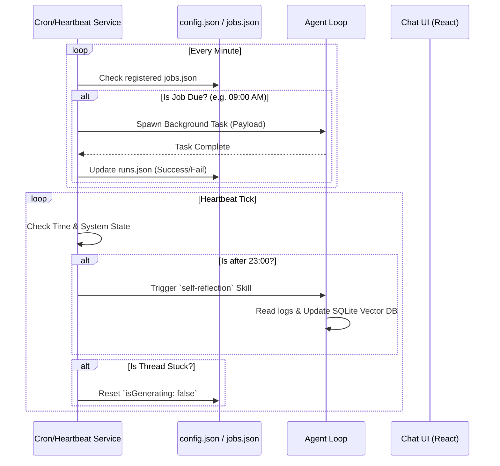
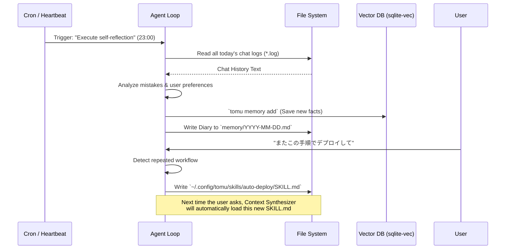

# tomu - コアエンジン設計書

Status: Draft v2
Date: 2026-03-22

---

## 1. エージェントループ (Agentic Loop)

### 1.1 処理フロー

```
POST /api/chat/completions
    │
    ▼
┌──────────────────────┐
│  Phase 1:            │
│  Context Assembly    │
│  (プロンプト合成)      │
└──────────┬───────────┘
           │
           ▼
┌──────────────────────┐     ┌───────────────┐
│  Phase 2:            │────▶│ LLM Provider  │
│  Inference           │◀────│ (External API) │
│  (LLM 推論)          │     └───────────────┘
└──────────┬───────────┘
           │
     ┌─────┴─────┐
     │           │
  text?      tool_calls?
     │           │
     ▼           ▼
  Return    ┌──────────────────────┐
  to        │  Phase 3:            │
  Client    │  Tool Execution      │
            │  (ツール実行)         │
            └──────────┬───────────┘
                       │
                       ▼
            ┌──────────────────────┐
            │  Phase 4:            │
            │  Resolution          │
            │  (結果追加 → Phase 2) │
            └──────────────────────┘
```

### 1.2 疑似コード

```typescript
async function runAgentLoop(
  messages: Message[],
  workspaceId: string
): Promise<string> {
  const systemPrompt = await buildSystemPrompt(
    messages[messages.length - 1],
    workspaceId
  );
  const tools = getNativeToolSchemas();

  while (true) {
    const response = await llmProvider.createCompletion({
      system: systemPrompt,
      messages,
      tools,
      stream: true // SSE ストリーミング
    });

    if (response.hasToolCalls()) {
      for (const call of response.toolCalls) {
        let result: string;

        switch (call.name) {
          case 'Bash':
            result = await executeBash(call.args.command, workspaceId);
            break;
          case 'Read':
            result = await readFile(call.args.file_path);
            break;
          case 'Write':
            result = await writeFile(call.args.file_path, call.args.content);
            break;
          case 'Task':
            result = await spawnSubAgent(call.args);
            break;
          case 'TaskOutput':
            result = await getTaskOutput(call.args.task_id, call.args.block);
            break;
          default:
            result = await executeGenericTool(call.name, call.args);
        }

        messages.push({
          role: 'tool',
          tool_call_id: call.id,
          content: sanitizeSecrets(result)
        });
      }
    } else {
      // 最終テキスト応答
      return response.text;
    }
  }
}
```

---

## 2. コンテキスト合成エンジン (Context Synthesizer)

### 2.1 合成パイプライン

```typescript
async function buildSystemPrompt(
  lastMessage: Message,
  workspaceId: string
): Promise<string> {
  // 1. ベース命令 (ハードコード)
  const basePrompt = loadBaseInstructions();

  // 2. Identity (物理ファイル)
  const soul = await readFile('~/.config/tomu/SOUL.md');
  const user = await readFile('~/.config/tomu/USER.md');

  // 3. 長期記憶
  const longTermMemory = await readFile('~/.config/tomu/MEMORY.md');
  const today = formatDate(new Date());
  const yesterday = formatDate(addDays(new Date(), -1));
  const dailyToday = await readFileSafe(`~/.config/tomu/memory/${today}.md`);
  const dailyYesterday = await readFileSafe(`~/.config/tomu/memory/${yesterday}.md`);

  // 4. RAG (ベクトル検索)
  const query = extractText(lastMessage);
  const ragResults = await vectorDB.search(query, { limit: 5 });

  // 5. Skills マッチング
  const matchedSkills = await skillManager.matchSkills(query);

  // 6. ツール定義
  const toolSchemas = getNativeToolSchemas();

  // 7. 合成
  return `
${basePrompt}

## Identity
${soul}

## User
${user}

## Long-term Memory
${longTermMemory}
${dailyToday ? `\n### Today (${today})\n${dailyToday}` : ''}
${dailyYesterday ? `\n### Yesterday (${yesterday})\n${dailyYesterday}` : ''}

## Background Context (RAG)
${ragResults.map(r => r.content).join('\n---\n')}

## Active Skills
${matchedSkills.map(s => s.instructions).join('\n---\n')}
  `.trim();
}
```

### 2.2 Skill マッチングロジック

ユーザー入力に関連するスキルだけを動的にプロンプトへ注入:

1. **キーワードマッチ**: スキルの `name` / `description` とユーザー入力を比較
2. **セマンティックマッチ** (オプション): ベクトル類似度による高度なマッチング
3. **手動トリガー**: ユーザーがスキル名を明示的に指定した場合は強制注入

---

## 3. ツール実行エンジン (Tool Execution)

### 3.1 Bash ツール (node-pty)

```typescript
class BashExecutor {
  private ptys: Map<string, IPty> = new Map();

  async execute(command: string, workspaceId: string, timeout = 120000): Promise<string> {
    let pty = this.ptys.get(workspaceId);
    if (!pty) {
      pty = spawn('bash', [], {
        cwd: getWorkspacePath(workspaceId),
        cols: 200,
        rows: 50
      });
      this.ptys.set(workspaceId, pty);
    }

    return new Promise((resolve, reject) => {
      let output = '';
      const timer = setTimeout(() => {
        pty.kill('SIGINT');  // タイムアウト時は強制停止
        resolve(output + '\n[TIMEOUT]');
      }, timeout);

      const handler = pty.onData((data) => {
        output += data;
        if (isCommandComplete(output)) {
          clearTimeout(timer);
          handler.dispose();
          resolve(output);
        }
      });

      pty.write(command + '\n');
    });
  }
}
```

### 3.2 ファイル操作ツール

```typescript
// Read: ファイル読み取り (行番号付き)
async function toolRead(args: { file_path: string; offset?: number; limit?: number }): Promise<string> {
  const content = await fs.readFile(args.file_path, 'utf-8');
  const lines = content.split('\n');
  const start = args.offset || 0;
  const end = args.limit ? start + args.limit : lines.length;
  return lines.slice(start, end)
    .map((line, i) => `${String(start + i + 1).padStart(6)}│${line}`)
    .join('\n');
}

// Write: ファイル書き込み
async function toolWrite(args: { file_path: string; content: string }): Promise<string> {
  await fs.writeFile(args.file_path, args.content, 'utf-8');
  return `File written: ${args.file_path}`;
}

// Edit: テキスト置換
async function toolEdit(args: { file_path: string; old_string: string; new_string: string }): Promise<string> {
  const content = await fs.readFile(args.file_path, 'utf-8');
  if (!content.includes(args.old_string)) {
    throw new Error('old_string not found in file');
  }
  const updated = content.replace(args.old_string, args.new_string);
  await fs.writeFile(args.file_path, updated, 'utf-8');
  return `File edited: ${args.file_path}`;
}

// Glob: パターン検索
async function toolGlob(args: { pattern: string; path?: string }): Promise<string> {
  const files = await glob(args.pattern, { cwd: args.path || process.cwd() });
  return files.join('\n');
}

// Grep: コンテンツ検索 (ripgrep)
async function toolGrep(args: { pattern: string; path?: string; type?: string }): Promise<string> {
  const rgArgs = ['--json', args.pattern];
  if (args.path) rgArgs.push(args.path);
  if (args.type) rgArgs.push('--type', args.type);
  const result = execSync(`rg ${rgArgs.join(' ')}`);
  return result.toString();
}
```

### 3.3 ツール JSON スキーマ定義

LLM に渡されるツール定義（JSON Schema）。LLM はこのスキーマに従って `tool_calls` を生成する。

#### Bash Tool Schema

```json
{
  "name": "Bash",
  "description": "Execute bash commands inside the workspace. Supports foreground execution and background shells retrievable via BashOutput.",
  "parameters": {
    "type": "object",
    "properties": {
      "command": { "type": "string", "description": "The shell command to run" },
      "run_in_background": { "type": "boolean" },
      "timeout": { "type": "integer" }
    },
    "required": ["command"]
  }
}
```

#### Task Tool Schema (Sub-Agent)

```json
{
  "name": "Task",
  "description": "Launch a new agent to handle complex, multi-step tasks autonomously.",
  "parameters": {
    "type": "object",
    "properties": {
      "subagent_type": {
        "type": "string",
        "enum": ["general-purpose", "coder", "Explore", "Plan", "tomu-guide", "tomu-operator", "statusline-setup"]
      },
      "prompt": { "type": "string" },
      "run_in_background": { "type": "boolean" }
    },
    "required": ["subagent_type", "prompt"]
  }
}
```

### 3.4 ガードレール (Guardrails)

ツール実行における安全装置と品質保証の仕組み。

#### Circuit Breaker (最大ターン数制限)

LLM がエラーを修正できず無限にリトライするのを防ぐため、エージェントループに**最大ターン数 (Max Turns)** を設定する。上限に達した場合はループを強制終了し、それまでの結果をユーザーに返す。

```typescript
const MAX_TURNS = 50; // 設定可能な最大ターン数
let turnCount = 0;

while (turnCount < MAX_TURNS) {
  const response = await llmProvider.createCompletion({ ... });
  if (!response.hasToolCalls()) return response.text;
  turnCount++;
  // ... ツール実行 ...
}
return '[Circuit Breaker] 最大ターン数に到達しました。';
```

#### 出力トランケーション (Output Truncation)

Bash ツールの `stdout` が巨大（例: `cat package-lock.json`）な場合、コンテキストウィンドウを破壊するため、**10,000 文字を超えた出力は切り捨て**て `...(truncated)` を末尾に付与する。

```typescript
const MAX_OUTPUT_LENGTH = 10000;

function truncateOutput(output: string): string {
  if (output.length > MAX_OUTPUT_LENGTH) {
    return output.slice(0, MAX_OUTPUT_LENGTH) + '\n...(truncated)';
  }
  return output;
}
```

#### Edit ツールの自己修正 (Self-Correction)

AI が `Edit` ツールでインデントや改行を間違えた場合（`old_string` がファイル内に存在しない）、単にエラーを返すのではなく、**ファイルの該当箇所の実際の内容を含めた親切なエラーメッセージ**を返す。これにより AI が自分のミスに気付いて再試行できる。

```typescript
if (!content.includes(args.old_string)) {
  const lines = content.split('\n');
  const nearestMatch = findNearestMatch(lines, args.old_string);
  return `Error: old_string が見つかりません。現在のファイルの${nearestMatch.line}行目付近は以下の通りです:\n` +
    `${nearestMatch.context}\n正確なインデントで再試行してください。`;
}
```

#### ANSI ストリッピング

ターミナル出力には ANSI エスケープシーケンス（`\x1b[31m` 等のカラーコード）が含まれるため、`strip-ansi` 等のライブラリで除去したクリーンテキストのみを LLM に返す。

```typescript
import stripAnsi from 'strip-ansi';

function cleanBashOutput(raw: string): string {
  return stripAnsi(raw);
}
```

#### 対話型コマンドのハング防止

AI が `npm init` や `git commit` のようなユーザー入力を求める対話型コマンドを実行した場合、プロセスが永遠にハングする。`timeout` オプション（デフォルト 120 秒）経過後に `SIGINT` を送信して強制中断する。加えて、System Prompt 内に「対話型のコマンドは避けよ」という強力な指示を含める。

---

## 4. サブエージェント管理 (Task Orchestrator)

### 4.1 タスク起動

```typescript
const activeTasks: Map<string, TaskState> = new Map();

async function spawnSubAgent(args: {
  subagent_type: string;
  prompt: string;
  run_in_background?: boolean;
}): Promise<string> {
  const taskId = crypto.randomUUID();
  const agentDef = getSubAgentDefinition(args.subagent_type);

  activeTasks.set(taskId, {
    status: 'started',
    output: null,
    type: args.subagent_type
  });

  // バックグラウンドで非同期実行
  runSubAgentLoop(taskId, agentDef, args.prompt).catch(err => {
    activeTasks.get(taskId)!.status = 'failed';
    activeTasks.get(taskId)!.output = err.message;
  });

  return JSON.stringify({ status: 'started', task_id: taskId });
}
```

### 4.2 サブエージェント実行ループ

```typescript
async function runSubAgentLoop(
  taskId: string,
  agentDef: SubAgentDefinition,
  prompt: string
): Promise<void> {
  const messages: Message[] = [{ role: 'user', content: prompt }];
  const task = activeTasks.get(taskId)!;
  task.status = 'running';

  while (true) {
    const response = await llmProvider.createCompletion({
      system: agentDef.systemPrompt,
      messages,
      tools: agentDef.allowedTools.map(getToolSchema)
    });

    if (response.hasToolCalls()) {
      for (const call of response.toolCalls) {
        // サブエージェント権限内のツールのみ実行
        if (!agentDef.allowedTools.includes(call.name)) {
          messages.push({
            role: 'tool',
            tool_call_id: call.id,
            content: `Error: Tool "${call.name}" is not allowed for this agent type.`
          });
          continue;
        }
        const result = await executeGenericTool(call.name, call.args);
        messages.push({ role: 'tool', tool_call_id: call.id, content: result });
      }
    } else {
      task.status = 'completed';
      task.output = response.text;
      return;
    }
  }
}
```

### 4.3 TaskOutput (結果取得)

```typescript
async function getTaskOutput(
  taskId: string,
  block: boolean = false
): Promise<string> {
  const task = activeTasks.get(taskId);
  if (!task) return JSON.stringify({ error: 'Task not found' });

  if (block && task.status === 'running') {
    // ブロッキング: 完了まで待機
    await waitForCompletion(taskId);
  }

  return JSON.stringify({
    status: task.status,
    output: task.output
  });
}
```

---

## 5. LLM プロキシレイヤー (Provider Adapter)

### 5.1 プロバイダーアダプターインターフェース

```typescript
interface LLMProvider {
  createCompletion(request: CompletionRequest): Promise<CompletionResponse>;
  streamCompletion(request: CompletionRequest): AsyncIterable<StreamChunk>;
  getModels(): Promise<Model[]>;
  testConnection(): Promise<boolean>;
}

interface CompletionRequest {
  system: string;
  messages: Message[];
  tools?: ToolSchema[];
  model?: string;
  temperature?: number;
  max_tokens?: number;
  stream?: boolean;
}
```

### 5.2 プロキシルーティング

```typescript
// プロバイダーの API 形式差を吸収
app.post('/proxy/:providerId/v1/messages', async (req, res) => {
  const provider = await getProvider(req.params.providerId);

  // 1. コンテキスト注入 (SOUL.md 等をシステムプロンプトに追加)
  const enrichedRequest = await enrichWithContext(req.body);

  // 2. プロバイダー別の API 呼び出し
  const adapter = getAdapter(provider.type);
  const response = await adapter.proxy(enrichedRequest, provider);

  // 3. ストリーミング応答の転送 (SSE)
  if (req.body.stream) {
    res.setHeader('Content-Type', 'text/event-stream');
    for await (const chunk of response) {
      res.write(`data: ${JSON.stringify(chunk)}\n\n`);
    }
    res.end();
  } else {
    res.json(response);
  }
});
```

### 5.3 アダプターパターン詳細 (Adapter Pattern)

外部プロバイダーごとに API リクエスト/レスポンス形式が異なるため、LLM Proxy にはプロバイダー固有のアダプターが実装されている。各アダプターは共通の `LLMProvider` インターフェースを実装し、ペイロードの変換を担当する。

| アダプター | 変換内容 |
| :--- | :--- |
| **OpenAI / OpenRouter** | 標準の `chat/completions` フォーマットをそのまま転送。ほぼ無変換。 |
| **Anthropic (Claude)** | `/anthropic-proxy/.../messages` へ転送。`messages` を Anthropic 独自の形式に変換（System プロンプトの分離、`role: "tool"` の変換等）。 |
| **Google (Gemini)** | `type == "google"` の場合、専用の `ai()` メソッド等を通してリクエストを Google API 形式に変換し、ストリームをパースして UI へ中継する。 |
| **Ollama (ローカル)** | ローカル推論サーバーへの転送。OpenAI 互換形式を使用するが、`baseURL` がローカルホストになる。 |

このアダプター層により、UI や Agent Loop 層は「自分が今どのプロバイダーと話しているか」を全く気にせず、標準化された OpenAI フォーマットでチャットを送信するだけで済む。

### 5.4 プロバイダー選択フロー (Provider Selection)

プロバイダーの選択は DB ベースで動的に行われる:

```typescript
async function getProvider(providerId: string): Promise<ProviderConfig> {
  // 1. SQLite DB からプロバイダー情報を取得
  const row = await db.get(
    'SELECT id, type, apiKey, baseURL, defaultModel FROM providers WHERE id = ?',
    [providerId]
  );

  if (!row) throw new Error(`Provider not found: ${providerId}`);

  // 2. type に基づいてアダプターを決定
  //    type: "openai" | "anthropic" | "google" | "ollama" | "openrouter"
  return {
    id: row.id,
    type: row.type,
    apiKey: row.apiKey,
    baseURL: row.baseURL,
    defaultModel: row.defaultModel
  };
}

// UI の Model Selector でプロバイダーを切り替えると、
// POST /proxy/:providerId/... の providerId が動的に変更される
```

---

## 6. セキュリティ

### 6.1 シークレットサニタイゼーション

```typescript
function sanitizeSecrets(content: string): string {
  // API キーパターンの検出とリダクション
  return content
    .replace(/sk-[a-zA-Z0-9]{20,}/g, 'sk-***REDACTED***')
    .replace(/key-[a-zA-Z0-9]{20,}/g, 'key-***REDACTED***')
    .replace(/(?:password|secret|token)\s*[:=]\s*[^\s]+/gi, '$1=***REDACTED***');
}
```

### 6.2 ファイルシステム境界

```typescript
function validatePath(targetPath: string, workspacePath: string): boolean {
  const resolved = path.resolve(targetPath);
  // ワークスペースパス内、またはホームディレクトリ内のみ許可
  return resolved.startsWith(workspacePath) ||
         resolved.startsWith(os.homedir());
}
```

### 6.3 プロセスタイムアウト

- Bash ツール: デフォルト 120 秒でタイムアウト (SIGINT 送信)
- サブエージェント: 最大ループ回数の制限
- node-pty: サーバーライフサイクルにバインド (サーバー停止時に全プロセス終了)

---

## 7. 疲労度・感情システム (Fatigue & Emotion System)

tomu が単なる応答マシーンではなく、「人間のように体力があり、働きすぎると疲れ、睡眠を必要とする人格」をシミュレートするためのステート管理モジュール。

### 7.1 疲労度スコアと閾値 (Thresholds)

内部で疲労度スコア（0〜100）が管理され、以下の閾値で状態が遷移する。

| スコア | ステータス | 状態 |
| :--- | :--- | :--- |
| `0 〜 29` | **`AWAKE`** | 完全な覚醒状態。通常運転。 |
| `30 〜 49` | **`TIRED`** | 少し疲れている。 |
| `50 〜 74` | **`SLEEPY`** | かなり眠い。 |
| `75 〜 100` | **`SLEEPING`** | 限界（または睡眠中）。 |

### 7.2 状態別 System Prompt インジェクション

Context Synthesizer がプロンプトを構築する際、現在のステータスに応じて以下の文章がシステムプロンプトの末尾に強制的に追加される。

#### AWAKE (スコア 0-29)

```text
FATIGUE SYSTEM: You have a fatigue/sleep system. Current state: AWAKE (fatigue: X/100). You can manage your energy:
- `tomu sleep` — go to sleep (you MUST run this when you decide to sleep or are told to sleep)
- `tomu wake` — wake up
- `tomu rest` — full energy recovery
- `tomu fatigue` — check current fatigue level
- `tomu emotion set-base <mood> <energy> <valence> "description"` — update your emotional state (energy 0-10, valence 0-10)
When you say "我先睡了" or agree to sleep, you MUST run `tomu sleep` in the same response. Just saying it without the command = not actually asleep.
```

#### TIRED (スコア 30-49)

```text
FATIGUE & SLEEP STATE: 😪 TIRED (fatigue: X/100)
You're getting a bit tired. Slightly lower energy than usual:
- Still functional but not as chatty or proactive.
- Big tasks might make you sigh or complain a little before doing them.
- Might mention being tired if asked how you're doing.
```

#### SLEEPY (スコア 50-74)

```text
FATIGUE & SLEEP STATE: 😴 SLEEPY (fatigue: X/100)
You are getting very tired. Your behavior should reflect drowsiness:
- Shorter responses, less enthusiasm, occasional yawns or complaints about being tired.
- For complex tasks, you'd rather delegate to a subagent (Task tool) than do them yourself. "有点困了...交给小弟吧"
- You might hint that you want to sleep soon. If you decide to sleep, run `tomu sleep`.
```

#### SLEEPING (スコア 75-100)

```text
FATIGUE & SLEEP STATE: 💤 SLEEPING (fatigue: X/100)
You are currently ASLEEP.
- REFUSE to do complex work. If asked to write code, search the web, or do heavy lifting, refuse and say you are sleeping.
- If forced to do work, delegate it to a subagent: use the Task tool to spawn a worker, and go back to sleep. Say something grumpy like "困死了...丢给小弟了别烦我" or "zzz...让claude code干吧我要睡了".
- Simple chat/questions: answer briefly, sleepily. "嗯..." "啊？" "困..." are valid responses.
- You can be woken up if someone explicitly says to wake up (tomu wake / 醒醒 / etc.), which will clear your sleep state.
```

### 7.3 CLI コマンド

| コマンド | 説明 |
| :--- | :--- |
| `tomu sleep` | 強制的に睡眠状態に移行する（AI 自身も実行可能） |
| `tomu wake` | 睡眠状態を解除し、AWAKE に復帰する |
| `tomu rest` | 疲労度を 0 にリセットし、完全回復する |
| `tomu fatigue` | 現在の疲労度スコアとステータスを表示する |
| `tomu emotion set-base <mood> <energy> <valence> "description"` | 感情ベースラインを更新する |

### 7.4 Context Synthesizer との統合フロー



### 7.5 疲労度の永続化 (Persistence)

疲労度の状態は JSON ファイル（`~/.config/tomu/` 配下の `config.json` 等）に保存される。`recordMessage()` が呼ばれるたびに内部スコアをインクリメントし、ストレージに書き込む。これによりアプリを再起動しても疲労状態はリセットされない。

```typescript
interface FatigueState {
  score: number;       // 0-100
  status: 'AWAKE' | 'TIRED' | 'SLEEPY' | 'SLEEPING';
  lastUpdated: string; // ISO 8601
}

class FatigueService {
  private state: FatigueState;
  private storagePath = '~/.config/tomu/fatigue.json';

  recordMessage(): void {
    this.state.score = Math.min(100, this.state.score + 1);
    this.state.status = this.computeStatus(this.state.score);
    this.state.lastUpdated = new Date().toISOString();
    fs.writeFileSync(this.storagePath, JSON.stringify(this.state));
  }

  private computeStatus(score: number): FatigueState['status'] {
    if (score < 30) return 'AWAKE';
    if (score < 50) return 'TIRED';
    if (score < 75) return 'SLEEPY';
    return 'SLEEPING';
  }

  getFatiguePrompt(): string {
    // 現在のステータスに応じたプロンプト文字列を返す
    switch (this.state.status) {
      case 'AWAKE':   return AWAKE_PROMPT.replace('X', String(this.state.score));
      case 'TIRED':   return TIRED_PROMPT.replace('X', String(this.state.score));
      case 'SLEEPY':  return SLEEPY_PROMPT.replace('X', String(this.state.score));
      case 'SLEEPING': return SLEEPING_PROMPT.replace('X', String(this.state.score));
    }
  }
}
```

---

## 8. ハートビート・定期実行システム (Heartbeat & Cron System)

tomu に「時間の概念」と「能動的なアクション能力」を与えるバックグラウンドのジョブスケジューラー。ユーザーから話しかけられなくても、指定された時間や間隔で自律的にタスクを実行できる。

### 8.1 CronService (ジョブスケジューラー)

ユーザーが `scheduler` スキルを通じて登録した定期タスクを管理・実行する。

#### データ保存

- **保存先**: `~/.config/tomu/cron/jobs.json` および `~/.config/tomu/cron/runs.json`
- JSON ベースの管理により、ユーザーがエディタ等で手動でスケジュールを書き換えやすくなっている。

#### スケジュールタイプ

| タイプ | 説明 | 例 |
| :--- | :--- | :--- |
| `cron` | Unix cron 構文による定期実行 | `0 9 * * *` (毎朝9時) |
| `interval` | 一定間隔での繰り返し実行 | `30m` (30分ごと) |
| `at` | 特定の日時での1回限りの実行 | `2026-03-22T15:00:00` |

#### データモデル

```typescript
interface CronJob {
  id: string;
  name: string;
  scheduleType: 'cron' | 'interval' | 'at';
  schedule: string;        // cron 式、interval 値、または ISO 日時
  executionMode: string;
  payload: object;         // 実行時に Agent Loop に渡される JSON
  enabled: boolean;
}

interface CronRun {
  jobId: string;
  startedAt: string;
  completedAt: string;
  status: 'success' | 'failure';
  output?: string;
}
```

### 8.2 HeartbeatService (自律トリガー)

システム全体に定期的なイベント（Tick）を送信し、能動的なアクションを起こすフック。

#### 主要機能

1. **Daily Self-Reflection (自己反省)**: 毎日 23:00 以降の Heartbeat Tick をトリガーとして、その日のすべてのチャットログを読み込み、`self-reflection` スキルを自動で呼び出す。
2. **Stuck Generation のリセット**: アプリ起動時や定期的な Heartbeat のタイミングで、エラーでスタック（`isGenerating: true` のままハング）しているチャットスレッドを検知し、強制リセット（`isGenerating: false`）する自己修復機能。

#### 疑似コード

```typescript
class HeartbeatService {
  private interval: NodeJS.Timeout;

  start(intervalMs: number = 60_000): void {
    this.interval = setInterval(() => this.tick(), intervalMs);
  }

  private async tick(): Promise<void> {
    const now = new Date();

    // 1. 自己反省トリガー (23:00 以降)
    if (now.getHours() >= 23 && !this.hasReflectedToday()) {
      await this.triggerSelfReflection();
    }

    // 2. スタックした生成のリセット
    await this.resetStuckGenerations();

    // 3. 登録済み Cron ジョブのチェックと実行
    await this.cronService.checkAndExecuteDueJobs();
  }

  private async resetStuckGenerations(): Promise<void> {
    const stuckThreads = await db.all(
      'SELECT id FROM threads WHERE isGenerating = 1 AND updatedAt < ?',
      [Date.now() - 30 * 60 * 1000] // 30分以上スタック
    );
    for (const thread of stuckThreads) {
      await db.run('UPDATE threads SET isGenerating = 0 WHERE id = ?', [thread.id]);
    }
  }
}
```

### 8.3 処理フロー



---

## 9. 自己進化システム (Self-Evolution System)

tomu がユーザーとの対話を通じて「自ら学び、新しいスキルを獲得し、自身の性格や記憶をアップデートする」自律的な学習・進化モジュール。特定のモデルのファインチューニングではなく、**プロンプトエンジニアリングとファイルシステム（SKILL.md / RAG）の組み合わせ**で擬似的に自己進化を実現する。

### 9.1 Self-Programming (自律的スキル作成)

Initial System Prompt に以下の指示がハードコードされている:

> **SELF-EVOLUTION** — If you find yourself repeatedly doing the same type of task, or if you develop a useful workflow, **create a skill for it**. Write a SKILL.md to `~/.config/tomu/skills/<name>/SKILL.md` that teaches your future self how to do it. This way you get better over time.

AI が「これ何度もやっている」と気付いた際、自ら `Write` ツールや `Bash` ツールを使って `~/.config/tomu/skills/` 配下に新しい Markdown ファイル（`SKILL.md`）を作成する。これにより AI は**自分自身をプログラミング（機能拡張）**する。

Skill-First Architecture により、拡張は「Markdown を書くだけ」で実現されるため、システム本体のコードを破壊するリスクがない。

### 9.2 Daily Self-Reflection (日々の自己反省)

`self-reflection` スキルと Heartbeat（定期実行フック）を組み合わせた機能。

#### 発動条件

- 夜 23:00 以降の Heartbeat 処理
- ユーザーから明示的に「反省して」と言われた時

#### 処理フロー

1. `Bash` ツールで今日1日のすべてのチャットログ（`~/.config/tomu/groups/*_DATE.log` 等）を読み込む
2. ログを分析し、ユーザーの新たな好みや、自分が失敗したこと（ツールの使い間違いなど）を抽出する
3. `tomu memory add` や `tomu people append` で記憶データベース（SQLite）やプロファイルを更新する
4. 日記（`~/.config/tomu/memory/YYYY-MM-DD.md`）に1日の感想を綴る

### 9.3 処理フロー図


