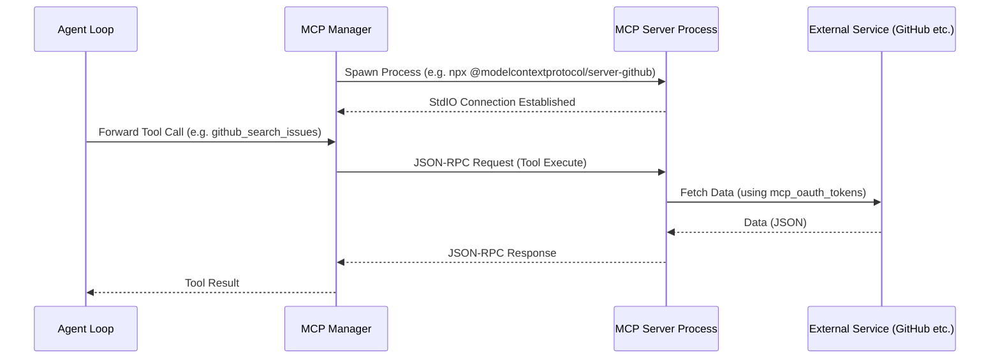

# tomu - スキル・プラグイン・拡張システム設計書

Status: Draft v2
Date: 2026-03-22

---

## 1. 拡張の二刀流: Skills vs Plugins

tomu には 2 種類の拡張メカニズムが存在する:

| | Skills | Plugins |
|:--|:-------|:--------|
| **実体** | Markdown (SKILL.md) | JS モジュール + manifest.json |
| **仕組み** | 動的プロンプト注入 | メインプロセスへのコードロード |
| **実行者** | AI (ツールを使って) | システム自身 |
| **作成難易度** | 誰でも (Markdown 記述のみ) | 開発者向け (JavaScript) |
| **拡張範囲** | AI の行動パターン | UI、ツール、プロバイダー、フック |
| **保存場所** | `~/.config/tomu/skills/` | `~/.config/tomu/plugins/` |

---

## 2. Skills システム

### 2.1 Skill の構造

```
~/.config/tomu/skills/
├── web-search/
│   └── SKILL.md
├── browser/
│   ├── SKILL.md
│   └── scripts/
│       └── helper.sh
├── image-gen/
│   └── SKILL.md
└── ...
```

### 2.2 SKILL.md フォーマット

```markdown
---
name: skill-name
description: "スキルの短い説明 (マッチングに使用)"
allowed-tools:
  - Bash
  - Read
  - WebFetch
---

# Skill Name

## Overview
このスキルは〜するためのものです。

## Instructions
1. ユーザーが〜を要求したら、以下の手順で実行する:
   - まず Bash で `command` を実行
   - 結果を解析して...

## Examples
- Input: "〜して"
- Action: Bash("command args")
```

### 2.3 Skill マネジメント

#### CLI コマンド

| コマンド | 説明 |
|:---------|:-----|
| `tomu skill install <user/repo>` | GitHub からスキルをインストール |
| `tomu skill uninstall <name>` | スキルのアンインストール (ディレクトリ削除) |
| `tomu skill search <query>` | コミュニティスキルの検索 |
| `tomu skill update` | 全スキルの最新版への更新 |
| `tomu skill list` | インストール済みスキル一覧 |

#### API エンドポイント

| Method | Endpoint | 説明 |
|:-------|:---------|:-----|
| GET | `/api/skills` | スキル一覧取得 |
| GET | `/api/skills/search` | スキル検索 |
| GET | `/api/skills/:id` | スキル詳細取得 |
| POST | `/api/skills/install` | スキルインストール (url + id 指定) |
| DELETE | `/api/skills/:id` | スキルアンインストール |
| PUT | `/api/skills/:id/toggle` | スキル有効/無効切り替え |

#### インストールフロー

```
1. URL 指定 → git clone --depth 1 ~/.config/tomu/skills/<name>
2. SKILL.md の存在確認 → YAML Frontmatter パース
3. メタデータ登録 (メモリ内キャッシュ)
4. 次回プロンプト合成時から自動適用
```

### 2.4 動的プロンプト注入の仕組み

```
ユーザー入力: "このWebページの内容を要約して"
    │
    ▼
Skill Matcher: "web" → web-search, web-fetch スキルにヒット
    │
    ▼
SKILL.md の instructions を読み込み
    │
    ▼
システムプロンプトの Active Skills セクションに注入
    │
    ▼
LLM がスキルのマニュアルに従ってツールを使用
```

### 2.5 主要なバンドルスキル

| スキル名 | 機能 | 使用ツール |
|:---------|:-----|:-----------|
| browser | Playwright によるブラウザ自動化 | BrowserOpen, BrowserClick, BrowserType |
| web-search | Google 等での検索 | WebSearch, WebFetch |
| web-fetch | Web ページ取得・Markdown 変換 | WebFetch, Bash |
| image-gen | AI 画像生成 | Bash (API 呼び出し) |
| voice | 音声合成 | Bash (Python TTS) |
| selfie | 自撮り画像生成 | image-gen + Identity |
| music-gen | 音楽生成 | Bash (外部 API) |
| music-listener | 再生中の音楽認識 | Bash (AppleScript) |
| screenshot | スクリーンキャプチャ | Bash (screencapture) |
| file-manager | ファイル整理・操作 | Read, Write, Bash |
| notebook | Jupyter 風ノート | Read, Write, Bash |
| scheduler | 定期タスク・リマインダー | Bash (cron) |
| todo | ToDo リスト管理 | Read, Write |
| travel | 旅行プラン・フライト検索 | WebSearch, WebFetch |
| telegram | Telegram Bot 連携 | Bash (API) |
| discord | Discord Bot 連携 | Bash (API) |
| thread-management | スレッド操作 | API 呼び出し |
| memory-management | 記憶の手動管理 | API 呼び出し |
| self-management | エージェント設定変更 | Read, Write |
| self-reflection | 自己内省・成長 | Read, Write |
| system-info | システム情報取得 | Bash |
| skill-hub | スキルの検索・インストール | Bash |
| plan-mode | 計画立案モード | Read, Glob, Grep |
| tasks | タスク管理 | Task, TaskOutput |

---

## 3. Plugin システム

### 3.1 Plugin 構造

```
~/.config/tomu/plugins/
└── my-plugin/
    ├── manifest.json
    ├── index.js          # メインエントリーポイント
    ├── ui/               # UI コンポーネント (オプション)
    │   └── panel.jsx
    └── README.md
```

### 3.2 manifest.json スキーマ

```json
{
  "id": "my-plugin",
  "name": "My Plugin",
  "version": "1.0.0",
  "description": "プラグインの説明",
  "author": "author-name",
  "main": "index.js",
  "permissions": [
    "filesystem",
    "network",
    "native-tools"
  ]
}
```

### 3.3 Plugin 管理 API

| Method | Endpoint | 説明 |
|:-------|:---------|:-----|
| GET | `/api/plugins` | プラグイン一覧 |
| POST | `/api/plugins` | インストール (GitHub URL) |
| POST | `/api/plugins/:id/enable` | 有効化 |
| POST | `/api/plugins/:id/disable` | 無効化 |
| DELETE | `/api/plugins/:id` | アンインストール |
| GET/PUT | `/api/plugins/:id/settings` | 設定の取得・更新 |
| GET/PUT | `/api/plugins/:id/permissions` | 権限の取得・更新 |
| POST | `/api/plugins/:id/update` | GitHub から最新版プル |

### 3.4 DB スキーマ詳細

Plugin の状態管理は SQLite に永続化される:

| テーブル | カラム | 説明 |
|:---------|:-------|:-----|
| `plugins` | `id` (PK), `name`, `version`, `source` (GitHub URL), `enabled` (boolean) | プラグイン本体の登録情報 |
| `plugin_settings` | `plugin_id`, `settings` (JSON) | プラグイン固有の設定データ |
| `plugin_permissions` | `plugin_id`, `permission_key`, `granted` (boolean) | プラグインが利用可能な OS 機能の権限管理 |

### 3.5 Plugin テーマサポート

プラグインは UI テーマを提供でき、以下の API で管理する:

| Method | Endpoint | 説明 |
|:-------|:---------|:-----|
| GET | `/api/plugin-themes` | 利用可能なテーマ一覧 |
| POST | `/api/plugin-themes/:id/apply` | テーマを適用 |
| POST | `/api/plugin-themes/clear` | テーマをクリア (デフォルトに戻す) |

### 3.6 Hooks 設定

プラグインはフック (イベントトリガー) を通じてシステムの各種タイミングに介入できる:

| Method | Endpoint | 説明 |
|:-------|:---------|:-----|
| GET | `/api/hooks` | 現在のフック設定を取得 |
| PUT | `/api/hooks` | フック設定を更新 |
| POST | `/api/hooks/reload` | フック設定をリロード |

### 3.7 インストールワークフロー

```
1. GitHub URL 指定
2. リポジトリをダウンロード (ZIP or clone)
3. manifest.json の存在確認・パース
4. ~/.config/tomu/plugins/<id>/ にファイル配置
5. メタデータを SQLite に永続化
6. enabled=true なら即座に activatePlugin() で JS ロード
```

---

## 4. MCP (Model Context Protocol) サーバー連携

### 4.1 概要

外部の MCP サーバーと接続し、AI に新しいツールやデータソースを動的に提供する。

### 4.2 MCP ワークフロー



### 4.3 MCP Client API エンドポイント

| Method | Endpoint | 説明 |
|:-------|:---------|:-----|
| GET | `/api/mcp-client/status` | MCP クライアント全体のステータス取得 |
| GET | `/api/mcp-client/tools` | 全 MCP サーバーが提供するツール一覧 |
| GET | `/api/mcp-client/resources` | 全 MCP サーバーが提供するリソース一覧 |
| POST | `/api/mcp-client/resources/read` | リソースの読み取り |
| POST | `/api/mcp-client/resources/subscribe` | リソースの変更購読 |
| POST | `/api/mcp-client/refresh` | 全 MCP サーバーのツール・リソースを再取得 |
| POST | `/api/mcp-client/reconnect/:name` | 指定サーバーへの再接続 |
| GET | `/api/mcp-marketplace` | MCP マーケットプレイス (利用可能なサーバー一覧) |

### 4.4 MCP サーバー管理 API

| Method | Endpoint | 説明 |
|:-------|:---------|:-----|
| GET | `/api/mcp-servers` | 登録済みサーバー一覧 |
| POST | `/api/mcp-servers` | サーバー追加 |
| DELETE | `/api/mcp-servers/:id` | サーバー削除 |
| GET | `/api/mcp-servers/:id/oauth/status` | OAuth 状態確認 |
| DELETE | `/api/mcp-servers/:id/oauth` | OAuth トークン削除 |

### 4.5 データ保存

- `mcp_servers` テーブル: `id` (PK), `name`, `command` (e.g. "npx"), `args` (JSON), `env` (JSON), `status`
- `mcp_oauth_tokens` テーブル: `server_id`, `access_token`, `refresh_token`, `expires_at` — MCP サーバーが必要とする外部 API (GitHub, Slack 等) の認証トークンをセキュアに管理
- ランタイム接続: `@modelcontextprotocol/sdk` による通信

---

## 5. 拡張性の設計原則

1. **Skills が第一選択**: 新機能は可能な限り SKILL.md (Markdown) で実装する
2. **Plugin は最終手段**: Skills では不可能な場合のみ Plugin (JS) を作成する
3. **MCP は外部統合用**: 外部サービスやデータベースとの接続には MCP を使う
4. **Git エコシステム活用**: Skills/Plugins の配布は GitHub リポジトリベース
5. **ホットリロード**: Skills は毎回のプロンプト合成時に最新ファイルを読み込む (再起動不要)
